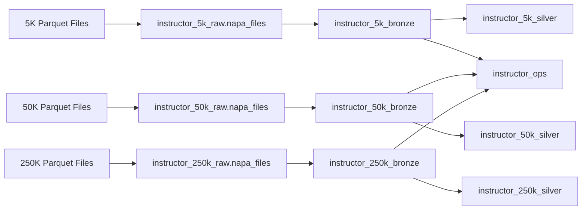

# NAPA Olympic Analytics Platform
# Raw-to-Bronze Layer Engineering Specification

**Document Version:** 1.0  
**Status:** Instructor Reference Implementation  
**Audience:** Instructor, Data Engineering Lead, Solution Architect, AI Coding Assistant  
**Platform:** Databricks Free Edition (serverless compute only), Unity Catalog, Delta Lake, PySpark  
**Pipeline Type:** Configuration-Driven Full Refresh  
**Release Instances:** `napa_5k`, `napa_50k`, `napa_250k`

---

# Table of Contents

1. Purpose  
2. Scope  
3. Architectural Context  
4. Target Catalog and Schema Design  
5. Release Strategy  
6. Raw Layer Specification  
7. Bronze Layer Specification  
8. Authoritative Source Inventory  
9. Configuration-Driven Design  
10. Repository Structure  
11. Configuration Files  
12. Source Registry  
13. Environment Configurations  
14. Processing Lifecycle  
15. Databricks Workflow Design  
16. Source Contract Validation  
17. Raw File Validation  
18. Bronze Table Creation  
19. Metadata Standards  
20. Schema Handling  
21. Data Preservation Rules  
22. Duplicate and Null Handling  
23. Error and Exception Handling  
24. Reconciliation  
25. Operations and Audit Tables  
26. Logging Standards  
27. Delta Publication Standards  
28. Security and Governance  
29. Testing Strategy  
30. Release Acceptance Criteria  
31. Migration from the Current Structure  
32. Runbook  
33. Definition of Done  
34. Codex Implementation Instructions  
35. Appendices  

---

# 1. Purpose

This document defines the engineering specification for ingesting the NAPA source Parquet files from the Raw layer into release-specific Bronze Delta tables.

The implementation shall create three separately materialized but structurally identical Raw-to-Bronze environments:

```text
napa_5k
napa_50k
napa_250k
```

All three environments shall use:

- one shared Git repository;
- one shared Raw-to-Bronze codebase;
- one shared Databricks Workflow definition;
- one shared source registry;
- one shared set of source contracts;
- three release-specific YAML configuration files;
- one shared operations schema.

The Raw-to-Bronze pipeline shall be deterministic, idempotent, full-refresh, and configuration-driven.

The pipeline shall preserve source data as delivered while adding operational metadata and converting each Parquet file into a managed Delta table.

Because Databricks Free Edition supports serverless compute only, the workflow and bundle design for this repository shall use serverless job-task configuration. The implementation shall not depend on existing clusters, job clusters, or cluster IDs.

---

# 2. Scope

## 2.1 Included

This specification covers:

- release-specific Raw schemas and Volumes;
- source Parquet file organization;
- source file inventory validation;
- source schema validation;
- release-aware configuration;
- parameterized Databricks Workflow execution;
- full-refresh Bronze table creation;
- ingestion metadata;
- schema snapshots;
- row-count reconciliation;
- operational logging;
- failure handling;
- testing;
- migration from the current instructor schemas.

## 2.2 Excluded

This specification does not include:

- business cleansing;
- domain normalization;
- duplicate removal;
- record rejection for business-quality issues;
- referential-integrity enforcement;
- Silver transformations;
- Gold feature engineering;
- machine-learning models;
- Olympic roster recommendations;
- incremental ingestion;
- change-data capture;
- streaming;
- Auto Loader;
- watermark processing;
- Delta `MERGE`.

Those capabilities either belong in the Bronze-to-Silver specification or are explicitly outside the NAPA reference implementation.

---

# 3. Architectural Context

The Raw-to-Bronze pipeline is the first executable stage of the NAPA medallion architecture.



The three release environments are not three different architectures. They are three instances of the same architecture.

The design objective is:

> The same Workflow and code shall process all three releases without code changes.

---

# 4. Target Catalog and Schema Design

Use the existing `workspace` catalog.

## 4.1 Raw Schemas and Volumes

```text
workspace.instructor_5k_raw
└── Volume: napa_files

workspace.instructor_50k_raw
└── Volume: napa_files

workspace.instructor_250k_raw
└── Volume: napa_files
```

Corresponding Volume paths:

```text
/Volumes/workspace/instructor_5k_raw/napa_files/
/Volumes/workspace/instructor_50k_raw/napa_files/
/Volumes/workspace/instructor_250k_raw/napa_files/
```

## 4.2 Bronze Schemas

```text
workspace.instructor_5k_bronze
workspace.instructor_50k_bronze
workspace.instructor_250k_bronze
```

Each Bronze schema shall contain the same thirteen table names.

## 4.3 Downstream Schemas

The complete medallion structure shall support:

```text
workspace.instructor_5k_raw
workspace.instructor_5k_bronze
workspace.instructor_5k_silver
workspace.instructor_5k_gold

workspace.instructor_50k_raw
workspace.instructor_50k_bronze
workspace.instructor_50k_silver
workspace.instructor_50k_gold

workspace.instructor_250k_raw
workspace.instructor_250k_bronze
workspace.instructor_250k_silver
workspace.instructor_250k_gold
```

This Raw-to-Bronze specification creates and manages only the Raw and Bronze objects.

## 4.4 Shared Operations Schema

Use one shared schema:

```text
workspace.instructor_ops
```

All operational records shall contain a `release_name` field so that 5K, 50K, and 250K runs can be compared directly.

---

# 5. Release Strategy

## 5.1 Release Roles

| Release | Intended Role | Approximate Players |
|---|---|---:|
| `napa_5k` | Development and smoke testing | 5,000 |
| `napa_50k` | Validation and scaling | 50,000 |
| `napa_250k` | Final production-scale case dataset | 250,000 |

## 5.2 Processing Consistency

The following shall remain identical across releases:

- source filenames;
- source table names;
- source schema contracts;
- Bronze table names;
- metadata columns;
- Workflow task graph;
- validation rules;
- publication logic;
- reconciliation logic.

The following may vary through environment configuration:

- Raw schema;
- Bronze schema;
- Volume path;
- expected approximate volumes;
- Spark performance settings;
- release role.

## 5.3 Recommended Execution Sequence

For instructor validation, execute:

```text
napa_5k
   ↓ success
napa_50k
   ↓ success
napa_250k
```

The 5K build should expose structural or configuration defects before larger datasets consume time and resources.

---

# 6. Raw Layer Specification

## 6.1 Purpose

The Raw layer stores the source Parquet files exactly as delivered.

The Raw layer is the immutable file-based source for Bronze.

## 6.2 Raw Layer Rules

Raw files shall:

- remain unchanged after upload;
- retain their authoritative filenames;
- remain in Parquet format;
- not be edited in place;
- not be overwritten by pipeline transformations;
- not contain pipeline-generated columns;
- not be queried directly by Silver or Gold;
- be readable only by authorized pipeline and instructor identities.

## 6.3 Volume Organization

Each release shall use one release-specific Volume named:

```text
napa_files
```

Recommended structure:

```text
/Volumes/workspace/instructor_5k_raw/napa_files/
├── regions.parquet
├── clubs.parquet
├── club_memberships.parquet
├── player_master.parquet
├── player_registrations.parquet
├── player_assessment_history.parquet
├── teams.parquet
├── team_memberships.parquet
├── matches.parquet
├── match_teams.parquet
├── match_team_players.parquet
├── match_games.parquet
└── monthly_batches.parquet
```

The 50K and 250K Volumes shall contain the same filenames.

## 6.4 No Nested Release Folder Required

Because each release has its own Raw schema and Volume, an additional nested directory such as:

```text
napa_files/napa_5k/
```

is not required.

The release identity is already represented by the schema:

```text
instructor_5k_raw
```

## 6.5 Raw Immutability

The Workflow shall never:

- rename Raw files;
- delete Raw files;
- move Raw files;
- modify file contents;
- write transformed data into the Raw Volume.

Any Raw file replacement shall be an explicit instructor-controlled action outside the pipeline.

---

# 7. Bronze Layer Specification

## 7.1 Purpose

The Bronze layer converts each Raw Parquet file into a managed Delta table while preserving the source data structure and values.

Bronze provides:

- a queryable Delta representation;
- a stable source for Silver;
- file and pipeline lineage;
- source schema evidence;
- row-count evidence;
- release isolation.

## 7.2 Bronze Layer Rules

Bronze shall:

- preserve source business columns;
- preserve source row grain;
- preserve duplicate rows;
- preserve null values;
- preserve invalid domain values;
- preserve orphan foreign keys;
- preserve historical records;
- add only operational metadata;
- use full-refresh publication;
- create one Delta table per source file.

Bronze shall not:

- trim or standardize business strings;
- normalize codes;
- remove duplicates;
- impute null values;
- derive analytical fields;
- enforce referential integrity;
- select “best” records;
- calculate Silver or Gold features.

## 7.3 Bronze Target Names

Each source file maps directly to a same-named Bronze table.

Example:

```text
/Volumes/workspace/instructor_5k_raw/napa_files/player_master.parquet
```

maps to:

```text
workspace.instructor_5k_bronze.player_master
```

The same mapping applies to 50K and 250K.

---

# 8. Authoritative Source Inventory

The NAPA dataset contains thirteen delivered Parquet source files.

| Sequence | Raw File | Bronze Table | Business Grain |
|---:|---|---|---|
| 1 | `regions.parquet` | `regions` | One geographic region |
| 2 | `clubs.parquet` | `clubs` | One club or facility |
| 3 | `club_memberships.parquet` | `club_memberships` | One player-club membership period |
| 4 | `player_master.parquet` | `player_master` | One current or snapshot player row |
| 5 | `player_registrations.parquet` | `player_registrations` | One registration event |
| 6 | `player_assessment_history.parquet` | `player_assessment_history` | One player assessment observation |
| 7 | `teams.parquet` | `teams` | One doubles team |
| 8 | `team_memberships.parquet` | `team_memberships` | One player-team membership period |
| 9 | `matches.parquet` | `matches` | One match |
| 10 | `match_teams.parquet` | `match_teams` | One match side |
| 11 | `match_team_players.parquet` | `match_team_players` | One player on a match side |
| 12 | `match_games.parquet` | `match_games` | One game within a match |
| 13 | `monthly_batches.parquet` | `monthly_batches` | One processing or snapshot batch |

The pipeline shall fail if any required source file is missing.

An unexpected additional file shall be reported and ignored unless added to configuration through an instructor-approved change.

---

# 9. Configuration-Driven Design

## 9.1 Configuration Responsibilities

Configuration shall control:

- active release;
- catalog;
- Raw schema;
- Raw Volume;
- Bronze schema;
- operations schema;
- source file inventory;
- source-to-target mappings;
- expected columns;
- expected data types;
- source key columns;
- execution order;
- file and schema validation policies;
- publication settings;
- operational metadata;
- performance settings.

## 9.2 Code Responsibilities

Reusable Python code shall implement:

- configuration loading;
- placeholder resolution;
- environment validation;
- file discovery;
- source contract validation;
- Parquet reading;
- metadata enrichment;
- Delta publication;
- schema snapshots;
- row reconciliation;
- operations logging;
- error handling.

## 9.3 Configuration Boundary

YAML shall define what to process.

Python shall define how to process it.

Do not embed arbitrary PySpark expressions or executable Python code in YAML.

---

# 10. Repository Structure

Recommended repository organization:

```text
config/
├── base.yml
├── environments/
│   ├── napa_5k.yml
│   ├── napa_50k.yml
│   └── napa_250k.yml
├── raw_sources.yml
└── logging.yml

notebooks/
├── 00_setup_release_schemas.py
├── 01_resolve_configuration.py
├── 02_validate_raw_sources.py
├── 03_build_bronze.py
├── 04_validate_bronze.py
└── 05_publish_ingestion_summary.py

src/napa_pipeline/
├── __init__.py
├── config.py
├── context.py
├── raw_validation.py
├── bronze_ingestion.py
├── schema.py
├── metadata.py
├── publish.py
├── reconciliation.py
├── logging.py
└── exceptions.py

tests/
├── unit/
├── integration/
└── acceptance/

docs/
├── raw_to_bronze_architecture.md
├── raw_source_contracts.md
├── raw_to_bronze_runbook.md
└── lineage_raw_to_bronze.md
```

Databricks notebooks should be thin execution wrappers.

The reusable implementation should live in importable Python modules wherever practical.

---

# 11. Configuration Files

## 11.1 `base.yml`

```yaml
project:
  name: napa_olympic_analytics
  pipeline_name: raw_to_bronze
  pipeline_version: "1.0.0"
  processing_mode: full_refresh

runtime:
  catalog: workspace
  team_prefix: instructor
  default_release: napa_5k
  timezone: America/Toronto

objects:
  raw_volume_name: napa_files
  operations_schema: instructor_ops

execution:
  fail_fast: true
  require_exact_source_inventory: true
  unexpected_file_policy: fail
  missing_file_policy: fail
  empty_file_policy: fail
  unexpected_column_policy: fail
  missing_required_column_policy: fail
  type_mismatch_policy: fail
  publish_only_after_validation: true

publication:
  format: delta
  mode: overwrite
  overwrite_schema: true
  use_staging: true

metadata:
  add_pipeline_run_id: true
  add_pipeline_version: true
  add_release_name: true
  add_source_file_name: true
  add_source_file_path: true
  add_source_file_size: true
  add_source_file_modification_ts: true
  add_ingested_ts: true
  add_source_record_hash: true

performance:
  cache_source_during_reconciliation: false
  optimize_after_publish: false
  vacuum_after_publish: false
```

## 11.2 Configuration Resolution

The configuration loader shall:

1. load `base.yml`;
2. load the selected release environment file;
3. load `raw_sources.yml`;
4. load logging configuration;
5. deep-merge settings;
6. resolve placeholders;
7. validate allowed values;
8. calculate a configuration hash;
9. return the resolved configuration.

The loader shall not use Python `eval`.

---

# 12. Source Registry

## 12.1 `raw_sources.yml`

```yaml
sources:
  regions:
    enabled: true
    file_name: regions.parquet
    bronze_table: regions
    build_order: 10
    grain: one geographic region
    key_columns: [id]

  clubs:
    enabled: true
    file_name: clubs.parquet
    bronze_table: clubs
    build_order: 20
    grain: one club or facility
    key_columns: [id]

  club_memberships:
    enabled: true
    file_name: club_memberships.parquet
    bronze_table: club_memberships
    build_order: 30
    grain: one player-club membership period
    key_columns: [id]

  player_master:
    enabled: true
    file_name: player_master.parquet
    bronze_table: player_master
    build_order: 40
    grain: one current or snapshot player row
    key_columns: [player_id]

  player_registrations:
    enabled: true
    file_name: player_registrations.parquet
    bronze_table: player_registrations
    build_order: 50
    grain: one player registration event
    key_columns: [id]

  player_assessment_history:
    enabled: true
    file_name: player_assessment_history.parquet
    bronze_table: player_assessment_history
    build_order: 60
    grain: one player assessment observation
    key_columns: [id]

  teams:
    enabled: true
    file_name: teams.parquet
    bronze_table: teams
    build_order: 70
    grain: one doubles team
    key_columns: [id]

  team_memberships:
    enabled: true
    file_name: team_memberships.parquet
    bronze_table: team_memberships
    build_order: 80
    grain: one player-team membership period
    key_columns: [id]

  matches:
    enabled: true
    file_name: matches.parquet
    bronze_table: matches
    build_order: 90
    grain: one match
    key_columns: [id]

  match_teams:
    enabled: true
    file_name: match_teams.parquet
    bronze_table: match_teams
    build_order: 100
    grain: one match side
    key_columns: [id]

  match_team_players:
    enabled: true
    file_name: match_team_players.parquet
    bronze_table: match_team_players
    build_order: 110
    grain: one player on a match side
    key_columns: [id]

  match_games:
    enabled: true
    file_name: match_games.parquet
    bronze_table: match_games
    build_order: 120
    grain: one game within a match
    key_columns: [id]

  monthly_batches:
    enabled: true
    file_name: monthly_batches.parquet
    bronze_table: monthly_batches
    build_order: 130
    grain: one processing or snapshot batch
    key_columns: [id]
```

## 12.2 Source Contract Extensions

After inspecting the actual Parquet schemas, extend each source definition with:

```yaml
required_columns:
  - id
  - region_id

expected_types:
  id: string
  region_id: string

allow_additional_columns: false
```

The physical source schema shall be documented and committed to source control.

---

# 13. Environment Configurations

## 13.1 `environments/napa_5k.yml`

```yaml
release:
  release_name: napa_5k
  expected_player_scale: 5000
  role: development

schemas:
  raw: instructor_5k_raw
  bronze: instructor_5k_bronze
  operations: instructor_ops

volume:
  name: napa_files
  path: /Volumes/workspace/instructor_5k_raw/napa_files

performance:
  shuffle_partitions: 16
```

## 13.2 `environments/napa_50k.yml`

```yaml
release:
  release_name: napa_50k
  expected_player_scale: 50000
  role: validation

schemas:
  raw: instructor_50k_raw
  bronze: instructor_50k_bronze
  operations: instructor_ops

volume:
  name: napa_files
  path: /Volumes/workspace/instructor_50k_raw/napa_files

performance:
  shuffle_partitions: 64
```

## 13.3 `environments/napa_250k.yml`

```yaml
release:
  release_name: napa_250k
  expected_player_scale: 250000
  role: production

schemas:
  raw: instructor_250k_raw
  bronze: instructor_250k_bronze
  operations: instructor_ops

volume:
  name: napa_files
  path: /Volumes/workspace/instructor_250k_raw/napa_files

performance:
  shuffle_partitions: auto
```

No source or table definitions shall be duplicated across these environment files.

---

# 14. Processing Lifecycle

Every Raw-to-Bronze run shall follow this sequence:

```text
Receive release_name
        ↓
Load and validate configuration
        ↓
Create pipeline_run_id
        ↓
Validate catalog, schemas, and Volume
        ↓
Validate exact Raw file inventory
        ↓
Validate each Parquet source contract
        ↓
Read source file
        ↓
Capture source row count and schema
        ↓
Add Bronze metadata
        ↓
Write run-scoped staging table
        ↓
Validate staging row count and schema
        ↓
Replace final Bronze Delta table
        ↓
Reconcile Raw and Bronze
        ↓
Record table result
        ↓
Validate complete Bronze schema
        ↓
Publish run summary
```

A source table shall not be published if its Raw source fails validation.

---

# 15. Databricks Workflow Design

For Databricks Free Edition, the Workflow must run on serverless compute only. Task definitions shall not rely on `existing_cluster_id`, job clusters, or any other classic-compute-only setting.

## 15.1 Workflow Name

Recommended Workflow:

```text
NAPA Raw to Bronze
```

## 15.2 Job Parameter

Required parameter:

```text
release_name
```

Allowed values:

```text
napa_5k
napa_50k
napa_250k
```

## 15.3 Recommended Tasks

```text
01_resolve_configuration
          ↓
02_validate_release_environment
          ↓
03_validate_raw_inventory
          ↓
04_build_bronze
          ↓
05_validate_bronze
          ↓
06_publish_ingestion_summary
```

## 15.4 Task Responsibilities

### Task 01 — Resolve Configuration

- validate `release_name`;
- load YAML;
- resolve schema and Volume names;
- calculate configuration hash;
- create pipeline run ID;
- write run-start status.

### Task 02 — Validate Release Environment

- confirm `workspace` catalog exists;
- confirm or create Raw schema;
- confirm or create Bronze schema;
- confirm or create operations schema;
- confirm the `napa_files` Volume exists;
- confirm permissions;
- confirm reusable code imports.

### Task 03 — Validate Raw Inventory

- list files in the release Volume;
- compare the list to thirteen configured files;
- fail on missing files;
- fail or warn on unexpected files according to policy;
- confirm each source is readable Parquet;
- capture file metadata.

### Task 04 — Build Bronze

- process enabled sources by configured order;
- validate the source contract;
- read Parquet;
- add ingestion metadata;
- publish using full replacement;
- record table metrics.

### Task 05 — Validate Bronze

- verify all thirteen tables exist;
- verify Bronze schema matches source plus metadata;
- verify Raw and Bronze row counts match;
- verify no business columns were removed;
- verify all metadata columns exist;
- capture Bronze schema snapshots.

### Task 06 — Publish Ingestion Summary

- reconcile the full run;
- mark the run successful or failed;
- display table-level results;
- persist final metrics.

## 15.5 Failure Behavior

- failures shall stop dependent tasks;
- deterministic source-contract failures shall not be retried automatically;
- transient infrastructure failures may use limited retries;
- final run status must reflect all table outcomes;
- a partially successful run shall not be marked successful.

---

# 16. Source Contract Validation

Before reading a source into Bronze, validate:

- file exists;
- filename matches configuration;
- extension is `.parquet`;
- file is readable;
- file is not empty unless explicitly allowed;
- schema contains all required columns;
- source data types match or are compatible with the contract;
- configured key columns exist;
- no unexpected columns exist when strict mode is enabled.

The Raw-to-Bronze pipeline validates structure, not business correctness.

Examples of issues that belong in Silver rather than Bronze:

- duplicate player IDs;
- invalid country values;
- null optional attributes;
- orphan region identifiers;
- overlapping membership periods.

---

# 17. Raw File Validation

## 17.1 Inventory Validation

Expected count:

```text
13 files
```

Required exact names:

```text
regions.parquet
clubs.parquet
club_memberships.parquet
player_master.parquet
player_registrations.parquet
player_assessment_history.parquet
teams.parquet
team_memberships.parquet
matches.parquet
match_teams.parquet
match_team_players.parquet
match_games.parquet
monthly_batches.parquet
```

## 17.2 File Metadata

Capture where available:

- file name;
- full file path;
- file size;
- file modification timestamp;
- Parquet schema;
- source row count;
- source schema hash.

## 17.3 Unexpected Files

Default policy:

```text
FAIL
```

This prevents accidental ingestion of backup files, old versions, or unrelated uploads.

Examples that should fail inventory validation:

```text
player_master (1).parquet
matches_old.parquet
README.txt
.DS_Store
```

The policy may be changed to `WARN` only through configuration.

---

# 18. Bronze Table Creation

## 18.1 Read Pattern

Each file shall be read as Parquet from the release-specific Volume path.

Conceptual example:

```python
source_df = spark.read.parquet(source_path)
```

Do not use schema inference for CSV or text because the sources are Parquet.

The Parquet physical schema shall be compared to the configured source contract.

## 18.2 Target Naming

Construct the target name from configuration:

```python
target_fqn = (
    f"{catalog}."
    f"{bronze_schema}."
    f"{bronze_table}"
)
```

No notebook shall hard-code:

```text
workspace.instructor_5k_bronze
```

## 18.3 Full-Refresh Write

Preferred pattern:

```python
(
    bronze_df.write
        .format("delta")
        .mode("overwrite")
        .option("overwriteSchema", "true")
        .saveAsTable(target_fqn)
)
```

A staging-table pattern is preferred where practical:

1. write to a run-scoped staging table;
2. validate row count and schema;
3. replace the final Bronze table;
4. remove staging after successful publication.

## 18.4 No Incremental Logic

Do not implement:

- `MERGE INTO`;
- append;
- file checkpoints;
- watermarks;
- last-run timestamps;
- row-level update detection;
- CDC.

---

# 19. Metadata Standards

Every Bronze table shall add the following columns.

| Column | Type | Purpose |
|---|---|---|
| `_pipeline_run_id` | `string` | Unique ingestion-run identifier |
| `_pipeline_name` | `string` | `raw_to_bronze` |
| `_pipeline_version` | `string` | Code/configuration version |
| `_release_name` | `string` | `napa_5k`, `napa_50k`, or `napa_250k` |
| `_source_file_name` | `string` | Authoritative source filename |
| `_source_file_path` | `string` | Full Volume path |
| `_source_file_size` | `long` | File size where available |
| `_source_file_modification_ts` | `timestamp` | File modification time where available |
| `_ingested_ts` | `timestamp` | Bronze ingestion timestamp |
| `_source_record_hash` | `string` | Deterministic hash of source business columns |

## 19.1 Source Record Hash

The source-record hash shall:

- include all original source columns;
- exclude all Bronze metadata columns;
- normalize null representation consistently;
- use deterministic column ordering;
- use SHA-256;
- preserve duplicate rows as duplicate hashes.

The hash supports:

- reproducibility;
- debugging;
- comparison across reruns;
- evidence that Raw values were preserved.

It is not used for incremental loading.

## 19.2 Metadata Column Collision

If a source file contains a column using a reserved metadata name, fail source-contract validation and require an explicit mapping decision.

Reserved names begin with:

```text
_
```

and specifically include all fields listed above.

---

# 20. Schema Handling

## 20.1 Source Schema as Authority

The delivered Parquet schema is authoritative for Bronze business columns.

Bronze shall preserve:

- column names;
- column order where practical;
- physical data types;
- nullability characteristics;
- nested structure where present.

## 20.2 Expected Schema Contract

The repository shall contain an expected contract for each source.

The contract shall identify:

- required columns;
- expected types;
- source key columns;
- whether additional columns are allowed;
- optional columns;
- source grain.

## 20.3 Schema Drift Policy

Default policy:

- missing required column: fail;
- incompatible type change: fail;
- unexpected column: fail;
- changed nullability: warn or fail according to contract;
- changed column order: informational only.

Schema differences shall be written to operations tables.

## 20.4 No Bronze Renaming

Do not rename source business columns in Bronze merely to enforce `snake_case`.

Column standardization belongs in Silver.

If the source already uses `snake_case`, preserve it.

---

# 21. Data Preservation Rules

Bronze shall preserve source data exactly except for added operational metadata.

The pipeline shall not:

- trim whitespace;
- change capitalization;
- map domain values;
- standardize dates into new business columns;
- replace null values;
- remove invalid rows;
- remove duplicates;
- join to other tables;
- calculate age;
- calculate status;
- calculate score margins;
- infer missing values.

The source row count shall equal the Bronze row count.

---

# 22. Duplicate and Null Handling

## 22.1 Duplicate Rows

Bronze shall preserve all duplicate rows.

Duplicate metrics may be profiled and recorded, but no duplicate shall be removed.

## 22.2 Duplicate Business Keys

Bronze shall preserve duplicate business keys.

Key duplicate counts may be recorded as source-quality observations.

Resolution occurs in Silver.

## 22.3 Null Values

Bronze shall preserve source null values.

The pipeline may record null counts for configured key columns, but it shall not reject or impute business records based solely on nulls.

A missing required source column is a source-contract failure. A null value inside an existing source column is a data-quality issue for Silver.

---

# 23. Error and Exception Handling

Define explicit exception classes:

```text
ConfigurationError
EnvironmentValidationError
RawInventoryError
SourceContractError
ParquetReadError
BronzePublicationError
ReconciliationError
```

Rules:

- never use bare `except`;
- preserve root exception details;
- write failure status before raising;
- never mark a failed table successful;
- never mark a partially published run successful;
- never silently skip a configured source;
- never continue to Bronze validation after a failed table build unless the task is explicitly designed to collect diagnostics only.

---

# 24. Reconciliation

## 24.1 Table-Level Reconciliation

Required equation:

```text
Raw Parquet Row Count = Bronze Delta Row Count
```

Because Bronze preserves all source rows, the difference must be zero.

## 24.2 Schema Reconciliation

Required:

```text
Bronze Business Columns
=
Raw Source Columns
```

Bronze may contain only the Raw columns plus approved metadata columns.

## 24.3 File Reconciliation

Required:

```text
Configured Source Files
=
Discovered Required Source Files
```

Unexpected-file policy is configuration-driven.

## 24.4 Run-Level Reconciliation

A run succeeds only when:

- thirteen configured sources were validated;
- thirteen Bronze tables were published;
- every table has a zero row-count difference;
- every target contains all required metadata;
- no critical source-contract failure remains.

---

# 25. Operations and Audit Tables

Use the shared schema:

```text
workspace.instructor_ops
```

## 25.1 `pipeline_runs`

```sql
CREATE TABLE IF NOT EXISTS workspace.instructor_ops.pipeline_runs (
    pipeline_run_id STRING NOT NULL,
    pipeline_name STRING NOT NULL,
    pipeline_version STRING NOT NULL,
    release_name STRING NOT NULL,
    processing_mode STRING NOT NULL,
    configuration_hash STRING NOT NULL,
    workflow_run_id STRING,
    status STRING NOT NULL,
    started_ts TIMESTAMP NOT NULL,
    completed_ts TIMESTAMP,
    duration_seconds DOUBLE,
    triggered_by STRING,
    error_class STRING,
    error_message STRING
)
USING DELTA;
```

## 25.2 `table_runs`

```sql
CREATE TABLE IF NOT EXISTS workspace.instructor_ops.table_runs (
    pipeline_run_id STRING NOT NULL,
    pipeline_name STRING NOT NULL,
    release_name STRING NOT NULL,
    source_file_name STRING NOT NULL,
    source_table STRING NOT NULL,
    target_table STRING NOT NULL,
    status STRING NOT NULL,
    started_ts TIMESTAMP NOT NULL,
    completed_ts TIMESTAMP,
    duration_seconds DOUBLE,
    source_file_size BIGINT,
    source_row_count BIGINT,
    bronze_row_count BIGINT,
    row_count_difference BIGINT,
    source_schema_hash STRING,
    bronze_schema_hash STRING,
    error_message STRING
)
USING DELTA;
```

## 25.3 `schema_snapshots`

```sql
CREATE TABLE IF NOT EXISTS workspace.instructor_ops.schema_snapshots (
    pipeline_run_id STRING NOT NULL,
    pipeline_name STRING NOT NULL,
    release_name STRING NOT NULL,
    layer_name STRING NOT NULL,
    object_name STRING NOT NULL,
    column_name STRING NOT NULL,
    data_type STRING NOT NULL,
    nullable BOOLEAN,
    ordinal_position INT,
    schema_hash STRING NOT NULL,
    captured_ts TIMESTAMP NOT NULL
)
USING DELTA;
```

## 25.4 `reconciliation_results`

```sql
CREATE TABLE IF NOT EXISTS workspace.instructor_ops.reconciliation_results (
    pipeline_run_id STRING NOT NULL,
    pipeline_name STRING NOT NULL,
    release_name STRING NOT NULL,
    source_file_name STRING NOT NULL,
    bronze_table STRING NOT NULL,
    raw_row_count BIGINT NOT NULL,
    bronze_row_count BIGINT NOT NULL,
    row_count_difference BIGINT NOT NULL,
    raw_business_column_count INT NOT NULL,
    bronze_business_column_count INT NOT NULL,
    metadata_column_count INT NOT NULL,
    status STRING NOT NULL,
    evaluated_ts TIMESTAMP NOT NULL
)
USING DELTA;
```

## 25.5 `run_messages`

```sql
CREATE TABLE IF NOT EXISTS workspace.instructor_ops.run_messages (
    pipeline_run_id STRING NOT NULL,
    pipeline_name STRING NOT NULL,
    release_name STRING NOT NULL,
    source_name STRING,
    message_level STRING NOT NULL,
    message_code STRING NOT NULL,
    message_text STRING NOT NULL,
    created_ts TIMESTAMP NOT NULL
)
USING DELTA;
```

The operations tables may also be used by the Bronze-to-Silver pipeline when distinguished by `pipeline_name`.

---

# 26. Logging Standards

Use Python logging for execution diagnostics and Delta operations tables for durable audit evidence.

Every log entry should include:

- pipeline run ID;
- pipeline name;
- release name;
- source file;
- target table;
- execution stage;
- elapsed time where relevant.

Do not log entire source records.

Recommended message levels:

```text
DEBUG
INFO
WARNING
ERROR
CRITICAL
```

Recommended message codes:

```text
CONFIG_LOADED
ENVIRONMENT_VALIDATED
RAW_FILE_MISSING
RAW_FILE_UNEXPECTED
SOURCE_SCHEMA_MISMATCH
SOURCE_READ_STARTED
SOURCE_READ_COMPLETED
BRONZE_WRITE_STARTED
BRONZE_WRITE_COMPLETED
ROW_COUNT_MISMATCH
SCHEMA_RECONCILIATION_FAILED
PIPELINE_SUCCEEDED
PIPELINE_FAILED
```

---

# 27. Delta Publication Standards

## 27.1 Managed Tables

Bronze targets should be managed Delta tables in the release-specific Bronze schema.

## 27.2 Table Comments

Each Bronze table should include a comment similar to:

> Raw-preserving Delta representation of the NAPA `<source>` Parquet file for release `<release_name>`. Business values are unchanged; operational ingestion metadata is appended.

## 27.3 Table Properties

Where supported, add properties such as:

```text
napa.layer = bronze
napa.release = napa_5k
napa.pipeline = raw_to_bronze
napa.processing_mode = full_refresh
```

## 27.4 Partitioning

Do not partition Bronze tables by default.

The source files already represent complete release extracts, and unnecessary partitioning may create many small files.

Partition only after measured evidence supports it.

## 27.5 `OPTIMIZE` and `VACUUM`

Both shall be configuration-controlled and disabled by default.

Do not disable retention safeguards.

---

# 28. Security and Governance

Apply the following controls:

- Raw Volumes are read-only to transformation logic;
- Bronze schemas are writable only by authorized pipeline and instructor identities;
- student team schemas shall not share instructor write permissions;
- credentials shall not be stored in YAML;
- no personal local paths shall be committed;
- destructive writes shall be restricted to configured Bronze targets and staging objects;
- configuration and pipeline code shall be version-controlled;
- Raw source replacement shall be instructor-controlled;
- operations history shall be retained;
- Gold or hidden simulation logic shall not appear in Raw or Bronze.

---

# 29. Testing Strategy

## 29.1 Unit Tests

Test:

- YAML loading;
- deep merge;
- placeholder resolution;
- release-name validation;
- path construction;
- target-name construction;
- source registry ordering;
- schema hash calculation;
- record hash calculation;
- metadata-column addition;
- reconciliation arithmetic;
- exception formatting.

## 29.2 Integration Tests

For a temporary release environment:

1. create a test Raw schema and Volume;
2. upload small Parquet fixtures;
3. run source validation;
4. build Bronze tables;
5. verify row preservation;
6. verify schema preservation;
7. verify metadata;
8. rerun and verify idempotence;
9. clean up test objects.

Required cases:

- valid source;
- missing file;
- unexpected file;
- unreadable file;
- empty file;
- missing required column;
- incompatible type;
- unexpected column;
- duplicate source rows;
- null business values.

Duplicate and null rows shall remain in Bronze.

## 29.3 Full-Refresh Test

Run the same release twice.

Verify:

- no duplicate Bronze rows were introduced;
- row count remains equal to Raw;
- business-column record hashes remain identical;
- only run-specific metadata changes where expected.

## 29.4 Failure Publication Test

Force a schema mismatch.

Verify:

- source table is not published;
- existing valid Bronze target is not replaced by invalid staging output;
- table run is marked failed;
- pipeline run is not marked successful;
- root error is recorded.

---

# 30. Release Acceptance Criteria

## 30.1 5K Acceptance

- all thirteen files present;
- all thirteen source contracts pass;
- all thirteen Bronze tables created;
- Raw and Bronze row counts match;
- metadata present;
- rerun succeeds;
- operations records complete.

## 30.2 50K Acceptance

- only release configuration changes;
- same table inventory and schemas;
- successful full refresh;
- performance metrics recorded;
- no code changes from 5K.

## 30.3 250K Acceptance

- only release configuration changes;
- complete full refresh;
- no full-data driver collection;
- all row-count reconciliations pass;
- all schema contracts pass;
- all Bronze tables query successfully;
- operations summary complete.

## 30.4 Cross-Release Acceptance

Verify:

- same thirteen target table names;
- compatible business schemas;
- same metadata columns;
- same pipeline version;
- same source contracts;
- separate namespaces;
- increasing row volumes where expected.

---

# 31. Migration from the Current Structure

The current instructor structure is:

```text
workspace.instructor_raw
workspace.instructor_bronze
workspace.instructor_silver
workspace.instructor_gold
workspace.instructor_ops
```

The target structure is:

```text
workspace.instructor_5k_raw
workspace.instructor_5k_bronze
workspace.instructor_5k_silver
workspace.instructor_5k_gold

workspace.instructor_50k_raw
workspace.instructor_50k_bronze
workspace.instructor_50k_silver
workspace.instructor_50k_gold

workspace.instructor_250k_raw
workspace.instructor_250k_bronze
workspace.instructor_250k_silver
workspace.instructor_250k_gold

workspace.instructor_ops
```

## 31.1 Migration Steps

1. Create the twelve release-specific medallion schemas.
2. Create `napa_files` Volume in each Raw schema.
3. Copy or re-upload the corresponding release files.
4. Verify the exact thirteen-file inventory.
5. Update YAML environment configurations.
6. Run the 5K Raw-to-Bronze Workflow.
7. Validate 5K Bronze.
8. Run 50K.
9. Run 250K.
10. Update Bronze-to-Silver configuration.
11. Freeze the old generic schemas.
12. Remove old schemas only after all downstream references are migrated and validated.

## 31.2 Do Not Delete Current Objects Immediately

Keep the current schemas during transition:

```text
instructor_raw
instructor_bronze
instructor_silver
instructor_gold
```

Mark them as legacy in documentation until:

- all three release instances build successfully;
- notebooks and Workflows use new configuration;
- no repository code references old names;
- instructor validation is complete.

---

# 32. Runbook

## 32.1 Load Raw Files

For the selected release:

1. open Catalog Explorer;
2. navigate to the release-specific Raw schema;
3. open the `napa_files` Volume;
4. upload the thirteen Parquet files;
5. confirm exact filenames;
6. remove accidental duplicates or backup copies before running the Workflow.

## 32.2 Run Raw-to-Bronze

1. Open the **NAPA Raw to Bronze** Workflow.
2. Select **Run now with different parameters**.
3. Set `release_name`.
4. Start the Workflow.
5. Monitor each task.
6. Review the final summary.
7. Query operations tables.
8. Verify the release-specific Bronze schema.

## 32.3 Investigate a Failure

1. identify the failed task;
2. review the task output;
3. query `pipeline_runs`;
4. query failed `table_runs`;
5. inspect `run_messages`;
6. verify Raw file name and path;
7. compare actual and expected schema;
8. correct the source, configuration, or code;
9. rerun the entire release.

Do not manually patch Bronze data.

## 32.4 Reviewer Queries

### Latest Runs

```sql
SELECT *
FROM workspace.instructor_ops.pipeline_runs
WHERE pipeline_name = 'raw_to_bronze'
ORDER BY started_ts DESC;
```

### Failed Tables

```sql
SELECT *
FROM workspace.instructor_ops.table_runs
WHERE pipeline_run_id = '<pipeline_run_id>'
  AND status <> 'SUCCEEDED';
```

### Reconciliation

```sql
SELECT *
FROM workspace.instructor_ops.reconciliation_results
WHERE pipeline_run_id = '<pipeline_run_id>'
ORDER BY bronze_table;
```

### Bronze Inventory

```sql
SHOW TABLES IN workspace.instructor_250k_bronze;
```

---

# 33. Definition of Done

The Raw-to-Bronze implementation is complete when:

## Architecture

- three release-specific Raw schemas exist;
- three `napa_files` Volumes exist;
- three release-specific Bronze schemas exist;
- one shared operations schema exists;
- one shared Workflow processes all releases.

## Configuration

- base configuration exists;
- three environment configurations exist;
- thirteen sources are registered;
- source contracts are complete;
- configuration validation is implemented;
- no release-specific constants exist in transformation code.

## Raw

- all thirteen files are present for each release;
- filenames are authoritative;
- files are immutable;
- inventory validation passes;
- file metadata is captured.

## Bronze

- thirteen Delta tables are created per release;
- source business rows are preserved;
- source business columns are preserved;
- metadata columns are appended;
- full-refresh reruns are idempotent;
- no incremental logic exists.

## Operations

- pipeline runs are logged;
- table runs are logged;
- schema snapshots are captured;
- row reconciliation is recorded;
- failures contain useful diagnostics.

## Testing

- unit tests pass;
- integration tests pass;
- full-refresh tests pass;
- failure-publication tests pass;
- 5K acceptance passes;
- 50K acceptance passes;
- 250K acceptance passes.

## Documentation

- architecture documented;
- source contracts documented;
- lineage documented;
- runbook documented;
- migration status documented.

---

# 34. Codex Implementation Instructions

## 34.1 Primary Prompt

Act as a Senior Databricks Data Engineer.

Implement the NAPA Raw-to-Bronze architecture described in this specification using Databricks-compatible PySpark, Delta Lake, Unity Catalog, YAML configuration, and Databricks Workflows.

Assume Databricks Free Edition is serverless-only when defining the Workflow or bundle. Do not propose classic compute or cluster-based task execution for this repository.

The implementation is an instructor reference build. It must be deterministic, configuration-driven, full-refresh, testable, and maintainable.

## 34.2 Required Discovery

Before coding:

1. inspect the repository;
2. inspect the current Databricks object naming assumptions;
3. inventory the actual Raw files;
4. inspect all Parquet schemas;
5. compare the actual inventory to the thirteen-source registry;
6. document discrepancies;
7. provide an implementation plan.

Do not invent source columns or filenames.

## 34.3 Required Implementation

Implement:

- configuration loader;
- environment resolver;
- pipeline context;
- schema and Volume setup;
- exact source inventory validation;
- source contract validation;
- Parquet ingestion;
- Bronze metadata enrichment;
- source record hashing;
- staging and full-refresh publication;
- row and schema reconciliation;
- operations logging;
- explicit exceptions;
- thin Workflow notebooks;
- unit and integration tests;
- documentation.

## 34.4 Mandatory Workflow Behavior

The Workflow must accept:

```text
release_name
```

and process:

```text
napa_5k
napa_50k
napa_250k
```

using the same code and source registry.

## 34.5 Prohibited Implementation

Do not implement:

- incremental ingestion;
- Delta `MERGE`;
- append processing;
- CDC;
- streaming;
- Auto Loader;
- watermarks;
- business cleansing;
- duplicate removal;
- null imputation;
- domain standardization;
- referential-integrity rejection;
- Silver calculations;
- Gold analytics;
- personal hard-coded paths;
- arbitrary `eval`;
- silent file skipping.

## 34.6 Completion Report

At completion, report:

- files created and changed;
- actual source inventory discovered;
- actual source schemas;
- configuration files created;
- Workflow tasks created;
- Raw and Bronze objects created;
- operations tables created;
- tests actually executed and results;
- assumptions requiring instructor review;
- differences from this specification;
- exact execution instructions.

Do not claim that Databricks execution passed unless it was actually run.

---

# 35. Appendices

## Appendix A — Target Object Matrix

| Release | Raw Schema | Volume | Bronze Schema |
|---|---|---|---|
| 5K | `workspace.instructor_5k_raw` | `napa_files` | `workspace.instructor_5k_bronze` |
| 50K | `workspace.instructor_50k_raw` | `napa_files` | `workspace.instructor_50k_bronze` |
| 250K | `workspace.instructor_250k_raw` | `napa_files` | `workspace.instructor_250k_bronze` |

Shared:

```text
workspace.instructor_ops
```

## Appendix B — Source-to-Target Matrix

| Raw File | Bronze Table |
|---|---|
| `regions.parquet` | `regions` |
| `clubs.parquet` | `clubs` |
| `club_memberships.parquet` | `club_memberships` |
| `player_master.parquet` | `player_master` |
| `player_registrations.parquet` | `player_registrations` |
| `player_assessment_history.parquet` | `player_assessment_history` |
| `teams.parquet` | `teams` |
| `team_memberships.parquet` | `team_memberships` |
| `matches.parquet` | `matches` |
| `match_teams.parquet` | `match_teams` |
| `match_team_players.parquet` | `match_team_players` |
| `match_games.parquet` | `match_games` |
| `monthly_batches.parquet` | `monthly_batches` |

## Appendix C — Architecture Summary

```text
One workspace catalog
One Git repository
One shared Raw-to-Bronze codebase
One parameterized Databricks Workflow
Three environment YAML files
Three Raw schemas
Three Raw Volumes
Three Bronze schemas
One shared operations schema
Thirteen source files per release
Full-refresh processing only
No business transformation in Bronze
```

## Appendix D — Layer Boundary

Raw answers:

> What source files were delivered?

Bronze answers:

> What source records and source schemas were delivered, represented as queryable Delta tables with ingestion lineage?

Silver answers:

> What standardized, validated operational facts and relationships does NAPA have?

Maintain these boundaries throughout the implementation.
