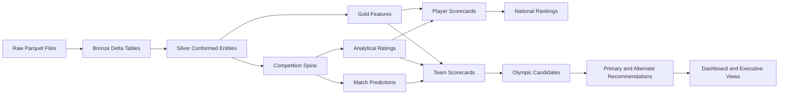
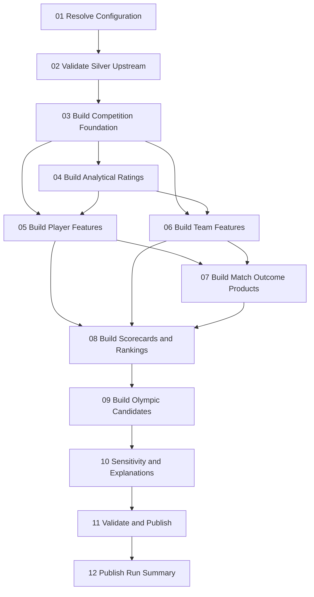

# NAPA Olympic Analytics Platform

# Silver-to-Gold Layer Engineering and Analytical Specification

**Document Version:** 1.0  
**Status:** Instructor Reference Implementation / Build Specification  
**Audience:** Instructor, Solution Architect, Data Engineering Lead, Data Science Lead, AI Coding Assistant (Codex)  
**Platform:** Databricks Free Edition, Unity Catalog, Delta Lake, PySpark, Spark SQL, optional Spark MLlib  
**Pipeline Type:** Configuration-driven, deterministic full refresh  
**Upstream Contract:** NAPA Bronze-to-Silver Layer Engineering Specification v1.1  
**Primary Production Release:** `napa_250k`  
**Supported Releases:** `napa_5k`, `napa_50k`, `napa_250k`

---

# Table of Contents

1. Purpose  
2. Business Outcomes  
3. Architectural Context  
4. Gold-Layer Design Principles  
5. Supported Releases and Namespaces  
6. Upstream Silver Contract  
7. Gold Scope  
8. Explicit Non-Requirements  
9. Analytical Time and Leakage Controls  
10. Gold Data Product Architecture  
11. Repository Organization  
12. Configuration Architecture  
13. Processing Lifecycle  
14. Databricks Workflow Design  
15. Standard Gold Metadata  
16. Analytical Grain and Key Standards  
17. Common Metric Standards  
18. Evidence Windows and Recency  
19. Eligibility Framework  
20. Competition Spine  
21. Persistent-Team Resolution  
22. Match Outcome Derivation  
23. Game and Point Metrics  
24. Strength of Schedule  
25. Player Match Participation  
26. Player Performance Features  
27. Player Consistency Features  
28. Player Trend and Development Features  
29. Analytical Rating Framework  
30. Rating Initialization  
31. Expected Match Outcome Formula  
32. Rating Update Formula  
33. Rating Confidence and Reliability  
34. Rating History Outputs  
35. Rating Validation  
36. Team and Partnership Features  
37. Partnership Continuity  
38. Partnership Performance  
39. Partnership Chemistry Proxy  
40. Match Outcome Modeling  
41. Training Dataset  
42. Time-Based Validation  
43. Baseline Probability Model  
44. Optional MLlib Model  
45. Model Evaluation  
46. Model Explainability  
47. Data Quality Confidence  
48. Feature Normalization  
49. Player Evaluation Scorecard  
50. National Player Rankings  
51. Development-Potential Scorecard  
52. Team Selection Scorecard  
53. Olympic Candidate Eligibility  
54. Olympic Candidate Rankings  
55. Primary and Alternate Recommendations  
56. Roster Constraint Handling  
57. Sensitivity Analysis  
58. Recommendation Explainability  
59. Gold Table Inventory  
60. Table Specifications  
61. Operational Views  
62. Dashboard-Ready Views  
63. Configuration Examples  
64. Gold Quality Framework  
65. Reconciliation  
66. Operations Tables  
67. Publication Standards  
68. Testing Strategy  
69. Performance Guidance  
70. Security, Governance, and Responsible Use  
71. Runbook  
72. Definition of Done  
73. Codex Implementation Instructions  
74. Appendices  

---

# 1. Purpose

## 1.1 Overview

This document defines the engineering and analytical specification for constructing the Gold layer of the NAPA Olympic Analytics Platform.

The Gold layer transforms validated Silver business entities into decision-ready analytical products that support:

- player evaluation;
- national player rankings;
- independently calculated analytical ratings;
- match outcome analysis and prediction;
- doubles partnership evaluation;
- player development and future-potential analysis;
- Olympic team candidate ranking;
- primary and alternate team recommendations;
- tournament candidate submission using valid existing team identifiers;
- executive dashboards, scorecards, and presentation evidence.

This specification is intended to be sufficiently complete for an AI coding assistant to build the instructor reference implementation without inventing undocumented source fields or hidden business rules.

## 1.2 Foundation

This design is based on the NAPA Bronze-to-Silver Layer Engineering Specification v1.1.

The upstream Silver layer provides standardized and validated operational entities:

```text
regions
clubs
club_memberships
players
player_registrations
player_assessment_history
teams
team_memberships
matches
match_teams
match_team_players
match_games
monthly_batches
```

The Gold layer shall read only from the selected release-specific Silver schema.

It shall not read Bronze tables, Raw files, or Parquet files directly.

## 1.3 Gold-Layer Question

The Silver layer answers:

> What standardized, validated operational facts and relationships does NAPA have?

The Gold layer answers:

> What do those facts imply about player strength, match outcomes, partnership effectiveness, development potential, and Olympic roster decisions?

---

# 2. Business Outcomes

The Gold layer shall enable the following NAPA outcomes.

## 2.1 Player Evaluation

NAPA decision makers shall be able to evaluate each player using evidence beyond the provided source rating.

Evaluation shall include, where supported by the delivered data:

- match volume;
- wins and losses;
- win percentage;
- game performance;
- point differential;
- opponent strength;
- strength of schedule;
- consistency;
- recent form;
- rating trajectory;
- assessment trajectory;
- evidence confidence;
- data quality confidence;
- national rank;
- development-potential rank.

## 2.2 Match Outcomes

The platform shall:

- derive correct match outcomes from Silver competition tables;
- calculate pre-match expected win probabilities from analytical ratings;
- optionally train a transparent predictive model using historical features;
- generate time-valid match outcome predictions;
- evaluate prediction quality using time-based validation;
- expose predicted probabilities and explanations.

## 2.3 Rating Calculation

The platform shall calculate an independent, transparent analytical rating history from match outcomes.

The calculated rating shall:

- remain separate from the rating supplied in `players`;
- process matches in chronological order;
- avoid future-data leakage;
- use deterministic configuration;
- record every rating update;
- expose confidence and evidence volume;
- support reproducibility and auditability.

## 2.4 Olympic Team Selection

The platform shall rank valid existing doubles teams for:

```text
United States:
- Men's Doubles
- Women's Doubles
- Mixed Doubles

Canada:
- Men's Doubles
- Women's Doubles
- Mixed Doubles
```

The exact category codes shall be resolved from the physical `teams` schema and configuration.

Recommendations shall:

- use valid existing team IDs;
- use valid team memberships;
- distinguish individual-player strength from partnership performance;
- incorporate uncertainty and data quality;
- include primary candidates and alternates;
- provide clear rationale and risk indicators;
- remain reproducible from the same Silver input and configuration.

## 2.5 Future Development

The Gold layer shall identify:

- rapidly improving players;
- players with strong performance but limited exposure;
- players whose calculated rating exceeds their supplied rating;
- emerging players with improving confidence;
- promising existing partnerships;
- players and teams suitable for a future Olympic Development Program.

No unsupported age-eligibility assumptions shall be introduced.

---

# 3. Architectural Context

## 3.1 Medallion Flow



## 3.2 Release-Specific Architecture

```text
workspace.instructor_5k_silver
        ↓
workspace.instructor_5k_gold

workspace.instructor_50k_silver
        ↓
workspace.instructor_50k_gold

workspace.instructor_250k_silver
        ↓
workspace.instructor_250k_gold
```

All releases share:

```text
workspace.instructor_ops
```

## 3.3 One Architecture, Three Instances

The implementation shall use:

```text
One Git repository
One shared Silver-to-Gold codebase
One parameterized Databricks Workflow
One shared feature and scoring definition
Three release environment configurations
Three release-specific Silver schemas
Three release-specific Gold schemas
One shared operations schema
```

The three releases are scale instances of one architecture.

They shall not contain different analytical logic.

---

# 4. Gold-Layer Design Principles

## 4.1 Configuration-Driven

Configuration shall control:

- active release;
- schema names;
- evidence windows;
- eligibility rules;
- rating parameters;
- feature definitions;
- normalization methods;
- scorecard component weights;
- model settings;
- recommendation counts;
- sensitivity scenarios;
- quality thresholds;
- publication behavior.

No notebook shall contain release-specific constants or final selection weights.

## 4.2 Deterministic

Given identical Silver data, configuration, code version, and random seed, the Gold business outputs shall be identical.

The implementation shall control:

- row ordering;
- match processing order;
- tie-breaking;
- model seed;
- train-validation cutoffs;
- normalization reference sets;
- score rounding;
- rank tie-breakers.

## 4.3 Full Refresh

Every Gold run rebuilds the complete Gold layer for the selected release.

The required implementation shall not use:

- incremental Gold loading;
- streaming;
- change data capture;
- append-only feature tables;
- Delta `MERGE`;
- uncontrolled model retraining.

## 4.4 Explainable by Construction

Every recommendation shall be traceable to:

```text
Silver records
→ derived metrics
→ normalized features
→ component scores
→ confidence adjustment
→ final score
→ rank
→ recommendation status
```

## 4.5 Separate Facts from Decisions

Gold shall distinguish:

- objective derived facts;
- analytical estimates;
- configured scores;
- eligibility decisions;
- final recommendations.

For example:

```text
team_win_pct                         objective derived metric
expected_win_probability            analytical estimate
partnership_performance_score       configured composite score
candidate_eligible_flag             deterministic rule result
recommendation_status               decision output
```

## 4.6 Preserve Competing Signals

The implementation shall not collapse all evidence into one score too early.

Decision makers should be able to compare:

- supplied player rating;
- independently calculated rating;
- observed win rate;
- adjusted win performance;
- prediction-based strength;
- partnership stability;
- consistency;
- development trend;
- evidence confidence;
- data quality confidence.

## 4.7 No Hidden Simulation Logic

The Gold implementation shall not:

- access instructor-only hidden simulation parameters;
- infer or reverse-engineer hidden simulation factors;
- encode unpublished tournament-engine rules;
- optimize directly against instructor tournament outcomes;
- use post-submission tournament results to revise historical recommendations.

The Gold layer shall use only the delivered NAPA data and documented analytical assumptions.

---

# 5. Supported Releases and Namespaces

## 5.1 Release Parameters

| Release Parameter | Approximate Players | Role |
|---|---:|---|
| `napa_5k` | 5,000 | Development and smoke testing |
| `napa_50k` | 50,000 | Feature, rating, and scaling validation |
| `napa_250k` | 250,000 | Production-scale recommendation build |

## 5.2 Namespace Pattern

| Release | Silver Schema | Gold Schema |
|---|---|---|
| 5K | `workspace.instructor_5k_silver` | `workspace.instructor_5k_gold` |
| 50K | `workspace.instructor_50k_silver` | `workspace.instructor_50k_gold` |
| 250K | `workspace.instructor_250k_silver` | `workspace.instructor_250k_gold` |

Shared operations schema:

```text
workspace.instructor_ops
```

Optional transient stage schemas:

```text
workspace.instructor_5k_stage
workspace.instructor_50k_stage
workspace.instructor_250k_stage
```

## 5.3 Authoritative Recommendation Release

The pipeline shall run successfully on all three release sizes.

However:

- 5K outputs are developmental;
- 50K outputs are validation evidence;
- 250K outputs are authoritative for final NAPA recommendations.

Every recommendation table shall include:

```text
_release_name
release_role
authoritative_recommendation_flag
```

For `napa_250k`:

```text
authoritative_recommendation_flag = true
```

For smaller releases:

```text
authoritative_recommendation_flag = false
```

---

# 6. Upstream Silver Contract

## 6.1 Required Upstream Success Gate

Before Gold processing begins, the Workflow shall identify a successful Bronze-to-Silver run in:

```text
workspace.instructor_ops.pipeline_runs
```

Required values:

```text
pipeline_name = 'bronze_to_silver'
release_name = <selected release>
status = 'SUCCEEDED'
```

The resolved Silver run ID shall become:

```text
upstream_pipeline_run_id
```

for the Gold run.

## 6.2 Required Silver Tables

The pipeline shall validate the presence of all enabled Silver sources.

Default required inventory:

```text
regions
clubs
club_memberships
players
player_registrations
player_assessment_history
teams
team_memberships
matches
match_teams
match_team_players
match_games
monthly_batches
```

## 6.3 Physical Schema Authority

Representative columns in this specification must be reconciled to the physical Silver schemas before implementation.

The code shall not invent a field merely because it appears in a conceptual document.

Examples:

- `match_teams` may not contain a persistent `team_id`;
- player country may require joining `players.home_region_id` to `regions`;
- category may be encoded in `teams.team_type`;
- active status may require interpreting `team_status`, membership dates, or player status;
- supplied rating fields may exist only in `players`.

## 6.4 Required Silver Metadata

Every source table shall be expected to include the metadata defined by the Silver specification, including:

```text
_pipeline_run_id
_pipeline_name
_pipeline_version
_release_name
_source_bronze_table
_bronze_pipeline_run_id
_load_ts
_record_hash
```

Optional fields shall be used when present:

```text
_data_quality_score
_data_quality_status
_source_file_name
_source_record_hash
```

## 6.5 Release Isolation

Every source row must match the selected release.

Gold shall fail if a selected Silver table contains rows from another release.

---

# 7. Gold Scope

Gold includes the following analytical responsibilities.

## 7.1 Required

- competition-ready denormalized facts;
- match and game outcome metrics;
- player participation metrics;
- player performance features;
- player trend and consistency features;
- independent analytical ratings;
- rating history and rating confidence;
- team and partnership performance features;
- strength-of-schedule measures;
- pre-match expected probabilities;
- optional predictive match model;
- national player rankings;
- development-potential rankings;
- team selection scorecards;
- candidate eligibility;
- primary and alternate recommendations;
- data quality confidence;
- explanation and sensitivity outputs;
- dashboard-ready views;
- operational evidence and reconciliation.

## 7.2 Optional but Supported

- MLlib logistic regression;
- gradient-boosted tree comparison;
- MLflow experiment logging where available;
- scenario-specific scorecards;
- roster optimization under configured constraints;
- monthly as-of scorecards derived from a full-refresh input.

Optional capabilities shall not be required for the baseline pipeline to succeed.

---

# 8. Explicit Non-Requirements

Do not implement:

- direct Raw or Bronze reads;
- incremental Gold loading;
- streaming;
- Delta `MERGE`;
- ad-hoc team construction;
- invented Olympic eligibility rules;
- unsupported age cutoffs;
- hidden simulation variables;
- tournament outcome reverse engineering;
- subjective scouting notes not present in the data;
- opaque black-box recommendations without feature evidence;
- random train-test splits for temporal match data;
- future match data in earlier rating or prediction calculations;
- a single score with no component visibility;
- manual editing of final recommendation rows;
- fabricated model performance;
- fabricated row counts;
- fabricated validation results;
- claims that Databricks execution passed unless it was actually run.

---

# 9. Analytical Time and Leakage Controls

## 9.1 As-of Date

Every Gold run shall resolve:

```text
analysis_as_of_date
```

Default:

```text
maximum valid match_date in the selected Silver release
```

The resolved value shall be recorded in:

- pipeline run metadata;
- all scorecards;
- all recommendation outputs;
- model run metadata.

Configuration may override it for backtesting.

## 9.2 Time-Valid Features

For any row representing a match prediction or historical rating:

```text
feature_timestamp < outcome_timestamp
```

No feature may use evidence from the match being predicted or from a later match.

## 9.3 Chronological Match Ordering

Rating calculations shall process matches using a deterministic order:

```text
match_date ASC,
batch_sequence ASC NULLS LAST,
match_id ASC
```

If multiple matches occur on the same date and no event timestamp exists, `match_id` shall be the deterministic tie-breaker.

## 9.4 Backtesting Cutoffs

Model validation shall use time-based splits.

Example default:

```text
training period: earliest match through 80% chronological cutoff
validation period: remaining 20%
```

A fixed calendar cutoff is preferred when sufficient data exists.

## 9.5 Current Scorecards

Current player and team scorecards shall use only matches:

```text
match_date <= analysis_as_of_date
```

Optional evidence windows may further restrict the history.

---

# 10. Gold Data Product Architecture

## 10.1 Product Families

```text
Foundation
├── competition_match_sides
├── competition_player_matches
└── resolved_match_teams

Ratings
├── player_rating_events
├── player_rating_history
└── player_current_ratings

Player Analytics
├── player_performance_features
├── player_development_features
├── player_evaluation_scorecards
└── national_player_rankings

Team Analytics
├── team_performance_features
├── partnership_effectiveness
├── team_selection_scorecards
└── olympic_team_candidates

Match Outcomes
├── match_outcome_training_set
├── match_outcome_predictions
└── match_model_metrics

Confidence and Governance
├── entity_data_quality_confidence
├── recommendation_explanations
├── selection_sensitivity_results
└── gold_run_summary
```

## 10.2 Data Product Levels

### Level 1 — Analytical Foundation

Reusable, mostly objective derived facts.

Examples:

```text
competition_match_sides
competition_player_matches
resolved_match_teams
```

### Level 2 — Features and Estimates

Reusable analytical measures.

Examples:

```text
player_performance_features
team_performance_features
player_current_ratings
match_outcome_predictions
```

### Level 3 — Decision Products

Configured scorecards and recommendations.

Examples:

```text
player_evaluation_scorecards
national_player_rankings
team_selection_scorecards
olympic_team_candidates
```

---

# 11. Repository Organization

Recommended structure:

```text
config/
├── environments/
│   ├── napa_5k.yml
│   ├── napa_50k.yml
│   └── napa_250k.yml
├── raw_to_bronze/
├── bronze_to_silver/
└── silver_to_gold/
    ├── base.yml
    ├── gold_tables.yml
    ├── eligibility.yml
    ├── evidence_windows.yml
    ├── ratings.yml
    ├── features.yml
    ├── models.yml
    ├── scorecards.yml
    ├── sensitivity.yml
    ├── quality_rules.yml
    └── logging.yml

src/
└── napa_pipeline/
    ├── common/
    │   ├── config.py
    │   ├── context.py
    │   ├── metadata.py
    │   ├── logging.py
    │   └── exceptions.py
    ├── raw_to_bronze/
    ├── bronze_to_silver/
    └── silver_to_gold/
        ├── io.py
        ├── time_controls.py
        ├── competition.py
        ├── team_resolution.py
        ├── metrics.py
        ├── ratings.py
        ├── features.py
        ├── normalization.py
        ├── match_models.py
        ├── eligibility.py
        ├── scorecards.py
        ├── recommendations.py
        ├── sensitivity.py
        ├── explainability.py
        ├── validation.py
        ├── reconciliation.py
        ├── publish.py
        └── transforms/

notebooks/
└── silver_to_gold/
    ├── 01_resolve_configuration.py
    ├── 02_validate_silver_upstream.py
    ├── 03_build_competition_foundation.py
    ├── 04_build_analytical_ratings.py
    ├── 05_build_player_features.py
    ├── 06_build_team_features.py
    ├── 07_build_match_outcome_products.py
    ├── 08_build_scorecards_and_rankings.py
    ├── 09_build_olympic_candidates.py
    ├── 10_build_sensitivity_and_explanations.py
    ├── 11_validate_and_publish.py
    └── 12_publish_run_summary.py

tests/
├── unit/
├── integration/
├── acceptance/
├── backtest/
└── fixtures/

docs/
├── NAPA_Raw_to_Bronze_Spec.md
├── NAPA_Bronze_to_Silver_Spec_v1.1.md
├── NAPA_Silver_to_Gold_Layer_Engineering_Spec_v1.0.md
├── data_dictionary_gold.md
├── gold_lineage.md
├── analytical_methodology.md
├── model_card_match_outcomes.md
├── selection_methodology.md
├── quality_rules_gold.md
└── runbook_gold.md
```

Notebooks shall be thin workflow wrappers.

Business logic belongs in tested Python modules.

---

# 12. Configuration Architecture

## 12.1 Shared Environment Configuration

The Gold pipeline shall reuse:

```text
config/environments/napa_5k.yml
config/environments/napa_50k.yml
config/environments/napa_250k.yml
```

Required environment values include:

```yaml
release:
  release_name: napa_250k
  release_role: production
  expected_player_scale: 250000

catalog: workspace

schemas:
  silver: instructor_250k_silver
  gold: instructor_250k_gold
  stage: instructor_250k_stage
  operations: instructor_ops
```

## 12.2 Gold Configuration Files

| File | Purpose |
|---|---|
| `base.yml` | Pipeline defaults and analysis date behavior |
| `gold_tables.yml` | Gold target registry and build order |
| `eligibility.yml` | Player and team eligibility rules |
| `evidence_windows.yml` | Historical and recent-form windows |
| `ratings.yml` | Analytical rating algorithm |
| `features.yml` | Feature definitions |
| `models.yml` | Match model settings |
| `scorecards.yml` | Score components and weights |
| `sensitivity.yml` | Alternative scoring scenarios |
| `quality_rules.yml` | Gold validation rules |
| `logging.yml` | Logging and operations settings |

## 12.3 Configuration Validation

The pipeline shall fail before processing if:

- release is unsupported;
- namespaces are missing;
- Gold schema equals Silver schema;
- an enabled Gold table references a missing transform;
- rating parameters are invalid;
- score weights are negative;
- configured weights do not total the expected amount;
- a feature references a missing dependency;
- eligibility category mappings are incomplete;
- a required tie-breaker is missing;
- a model uses random splitting;
- a sensitivity scenario has invalid weights;
- unresolved configuration placeholders remain.

---

# 13. Processing Lifecycle

```text
Receive release_name
        ↓
Resolve environment and Gold configuration
        ↓
Resolve analysis_as_of_date
        ↓
Validate successful Silver upstream run
        ↓
Validate required Silver tables and schemas
        ↓
Create Gold pipeline run
        ↓
Build competition foundation
        ↓
Resolve persistent team IDs where possible
        ↓
Calculate analytical ratings
        ↓
Build player features
        ↓
Build team and partnership features
        ↓
Build match prediction products
        ↓
Build player and team scorecards
        ↓
Apply eligibility rules
        ↓
Rank candidates and assign recommendation status
        ↓
Run sensitivity and explanation outputs
        ↓
Validate Gold relationships and score ranges
        ↓
Reconcile and publish
        ↓
Complete run summary
```

---

# 14. Databricks Workflow Design

## 14.1 Workflow Parameter

Required job parameter:

```text
release_name
```

Allowed values:

```text
napa_5k
napa_50k
napa_250k
```

Optional parameters:

```text
analysis_as_of_date
scoring_scenario
model_enabled
```

Defaults shall be resolved by configuration.

## 14.2 Task Graph



## 14.3 Retry Behavior

- deterministic data or contract failures: no automatic retry;
- transient platform failures: limited retry;
- model task: retry only with identical seed and configuration;
- dependent tasks shall not run after a critical upstream failure.

## 14.4 Repair Runs

A Databricks repair run may rerun failed tasks and downstream dependencies.

However, the Gold pipeline shall not report success unless:

- all required tasks use the same Gold pipeline run context;
- upstream Silver lineage is unchanged;
- configuration hash is unchanged;
- all final validation and reconciliation tasks pass.

Where task-level repair complicates run identity, rerun the complete Gold workflow.

---

# 15. Standard Gold Metadata

Every persisted Gold table shall include:

| Column | Description |
|---|---|
| `_pipeline_run_id` | Current Silver-to-Gold run ID |
| `_pipeline_name` | `silver_to_gold` |
| `_pipeline_version` | Code/configuration version |
| `_release_name` | Selected release |
| `_silver_pipeline_run_id` | Upstream Bronze-to-Silver run ID |
| `_analysis_as_of_date` | Analytical cutoff |
| `_scoring_scenario` | Active scorecard scenario where relevant |
| `_load_ts` | Publication timestamp |
| `_record_hash` | Deterministic hash of Gold business columns |

Decision products shall additionally include:

```text
methodology_version
feature_definition_version
rating_method_version
model_version
eligibility_rule_version
```

Run-specific metadata shall be excluded from business hashes.

---

# 16. Analytical Grain and Key Standards

Each Gold table shall document:

- business question;
- grain;
- primary key;
- source tables;
- cutoff behavior;
- feature definitions;
- null behavior;
- intended use;
- limitations.

Examples:

| Table | Grain | Primary Key |
|---|---|---|
| `competition_match_sides` | One team side per match | `(match_id, team_number)` |
| `competition_player_matches` | One player participation per match side | `(match_id, team_number, player_id)` |
| `player_rating_events` | One player rating change per match | `(match_id, player_id)` |
| `player_current_ratings` | One player as of analysis date | `player_id` |
| `player_performance_features` | One player as of analysis date/window | `(player_id, evidence_window)` |
| `team_performance_features` | One persistent team as of analysis date/window | `(team_id, evidence_window)` |
| `match_outcome_predictions` | One prediction per match side or canonical match | `match_id` |
| `national_player_rankings` | One player per country/category/ranking scenario | `(country_code, ranking_group, player_id)` |
| `olympic_team_candidates` | One valid team per country/category/scenario | `(country_code, category_code, team_id, scoring_scenario)` |

Natural source identifiers shall be retained.

---

# 17. Common Metric Standards

## 17.1 Percentages

Columns ending in `_pct` shall use:

```text
0 to 100
```

Example:

```text
team_win_pct = 68.4
```

## 17.2 Ratios and Probabilities

Columns ending in `_ratio` or `_probability` shall use:

```text
0.0 to 1.0
```

## 17.3 Scores

Composite score columns shall use:

```text
0 to 100
```

unless explicitly documented otherwise.

## 17.4 Rounding

Internal calculations shall retain full precision.

Published scorecards may round display values, but ranking shall use unrounded values.

## 17.5 Nulls

A missing feature shall not automatically become zero.

Configuration shall define one of:

```text
EXCLUDE_COMPONENT_AND_REWEIGHT
IMPUTE_REFERENCE_MEDIAN
APPLY_EXPLICIT_PENALTY
INELIGIBLE
```

The chosen behavior shall be visible in output metadata.

---

# 18. Evidence Windows and Recency

## 18.1 Default Windows

Suggested reference windows:

```yaml
evidence_windows:
  career:
    days: null
  trailing_365:
    days: 365
  trailing_180:
    days: 180
  trailing_90:
    days: 90
```

The actual history may be shorter than one year.

## 18.2 Current Recommendation Window

Default selection scorecards should use:

```text
trailing_365 or all available history, whichever is shorter
```

with separate recent-form features from:

```text
trailing_90
```

## 18.3 Recency Weighting

Optional exponential recency weight:

```text
weight = 0.5 ^ (days_since_match / half_life_days)
```

Suggested default:

```text
half_life_days = 120
```

Recency-weighted metrics shall be published alongside unweighted metrics.

## 18.4 Minimum Evidence

Minimum match thresholds shall be configurable.

They shall generally affect:

- confidence;
- recommendation risk;
- eligibility only when explicitly required.

Low match volume should normally reduce confidence rather than automatically exclude a player or team.

---

# 19. Eligibility Framework

Eligibility is a deterministic rules layer separate from scoring.

## 19.1 Player Eligibility

Default player candidate checks:

- player exists in Silver `players`;
- player status is allowed by configuration;
- player has a resolvable home country;
- country is `USA` or `CAN` using configured codes;
- player is active as of the analysis date where status supports this;
- player has no critical Silver quality failure affecting identity or country;
- player belongs to the required gender category where the physical schema supports it.

## 19.2 Team Eligibility

Default team checks:

- team exists in Silver `teams`;
- team identifier is not null;
- team country matches the candidate country;
- team category maps to a supported Olympic category;
- team is active as of the analysis date;
- team has exactly two valid players;
- both players resolve to Silver `players`;
- membership dates include the analysis date or the latest documented active period;
- team is not dissolved before the analysis date;
- team has no critical relationship failure;
- team is an existing dataset team, not an analytical synthetic pairing.

## 19.3 Evidence Sufficiency

Evidence sufficiency shall be separate from eligibility.

Example statuses:

```text
SUFFICIENT
LIMITED
VERY_LIMITED
NO_MATCH_EVIDENCE
```

A valid team with limited evidence may remain a candidate but receive:

- lower confidence;
- a visible risk flag;
- an alternate or watchlist recommendation.

## 19.4 Category Mapping

Category mappings shall be externalized.

Example only:

```yaml
category_mapping:
  mens_doubles:
    team_type_values: ["MENS", "MEN", "MD"]
    required_player_genders: ["M", "M"]
  womens_doubles:
    team_type_values: ["WOMENS", "WOMEN", "WD"]
    required_player_genders: ["F", "F"]
  mixed_doubles:
    team_type_values: ["MIXED", "XD"]
    required_player_genders: ["F", "M"]
```

The implementation must inspect actual source values.

---

# 20. Competition Spine

## 20.1 Purpose

`competition_match_sides` is the central Gold analytical foundation.

It shall convert Silver match, side, player, and game records into one consistent row per match side.

## 20.2 Sources

```text
matches
match_teams
match_team_players
match_games
regions
monthly_batches
```

## 20.3 Grain

```text
One row per match and team_number
```

## 20.4 Core Columns

Representative columns:

```text
match_id
match_date
batch_id
batch_sequence
match_region_id
match_country_code
match_type
court_type
match_format
team_number
opponent_team_number
side_score
opponent_score
won_flag
lost_flag
point_differential
point_share
games_won
games_lost
game_differential
close_game_count
deciding_game_flag
average_team_rating_at_match
opponent_average_team_rating_at_match
player_one_id
player_two_id
canonical_player_pair_key
resolved_team_id
team_resolution_status
```

## 20.5 Outcome Authority

Use the documented winner field when it is valid.

Cross-check it against:

- side score;
- game wins;
- game score evidence.

Disagreements shall be logged.

The outcome shall not be silently changed unless a documented deterministic rule identifies an authoritative field.

---

# 21. Persistent-Team Resolution

## 21.1 Problem

The representative `match_teams` schema may contain:

```text
match_id
team_number
team_score
average_team_rating
```

without a persistent `team_id`.

Gold partnership evaluation and tournament recommendations require a valid existing `teams.id`.

## 21.2 Resolution Hierarchy

For each match side:

### Method 1 — Direct Team ID

If the physical Silver `match_teams` table contains a valid persistent `team_id`, use it.

```text
team_resolution_method = DIRECT
```

### Method 2 — Active Membership Pair Match

Construct:

```text
canonical_player_pair_key =
least(player_id_1, player_id_2) || ':' || greatest(player_id_1, player_id_2)
```

Match the pair to `team_memberships` and `teams` where:

- both players belong to the same team;
- membership periods include `match_date`;
- team formation/dissolution dates include `match_date`;
- country and category are compatible where available.

```text
team_resolution_method = ACTIVE_MEMBERSHIP_PAIR
```

### Method 3 — Unique Historical Pair

If no date-valid team is found, resolve only when the player pair maps to exactly one persistent team across all history.

```text
team_resolution_method = UNIQUE_HISTORICAL_PAIR
```

This method shall carry a lower confidence.

### Unresolved or Ambiguous

If zero or multiple valid teams remain:

```text
resolved_team_id = null
team_resolution_status = UNRESOLVED or AMBIGUOUS
```

## 21.3 Usage Rules

Unresolved match sides:

- remain in player-level performance calculations;
- remain in rating calculations;
- may remain in generic pair analysis using `canonical_player_pair_key`;
- shall not be attributed to a persistent team candidate;
- shall not create a new team ID;
- shall not be used as a tournament candidate.

## 21.4 Resolution Quality Metrics

Publish:

```text
direct_resolution_count
active_pair_resolution_count
historical_pair_resolution_count
ambiguous_count
unresolved_count
persistent_team_resolution_pct
```

---

# 22. Match Outcome Derivation

## 22.1 Match-Side Result

For each side:

```text
won_flag = 1 when side is recorded winner
lost_flag = 1 - won_flag
```

No ties are expected unless the delivered schema explicitly supports them.

## 22.2 Score Validation

Validate:

```text
won_flag = 1 implies side_score > opponent_score
```

where match-side score is available.

If side score represents games rather than points, document it.

## 22.3 Game Validation

Game-level winner shall agree with:

```text
team_one_score
team_two_score
winning_team_number
```

## 22.4 Match-Level Derived Measures

```text
point_differential = side_score - opponent_score
point_share = side_score / (side_score + opponent_score)
game_differential = games_won - games_lost
sweep_flag = games_lost = 0
deciding_game_flag = match reached maximum expected game count
```

Where `side_score` is not point-based, use aggregated game points from `match_games`.

---

# 23. Game and Point Metrics

## 23.1 Player and Team Measures

Aggregate from `match_games`:

```text
games_played
games_won
games_lost
game_win_pct
points_for
points_against
point_differential
point_share
average_point_margin
median_point_margin
close_games
close_game_win_pct
deciding_games
deciding_game_win_pct
sweep_wins
sweep_losses
```

## 23.2 Close Game Definition

Configurable example:

```text
absolute point margin <= 2
```

The rule must consider target score and win-by rules where necessary.

## 23.3 Pressure Proxy

A transparent pressure-performance proxy may use:

- deciding games;
- close games;
- matches against high-rated opponents;
- comeback evidence if game sequence permits.

The output shall be labeled as a proxy, not a direct psychological measure.

---

# 24. Strength of Schedule

## 24.1 Opponent Rating

For each match, use the opponent’s pre-match analytical team rating.

If unavailable during initial baseline construction, use:

1. provided `average_team_rating` at match;
2. average `player_rating_at_match`;
3. supplied current player rating only as a documented fallback.

## 24.2 Measures

```text
average_opponent_rating
median_opponent_rating
top_quartile_opponent_match_pct
wins_above_rating_expectation
losses_below_rating_expectation
opponent_adjusted_win_score
strength_of_schedule_percentile
```

## 24.3 Opponent-Adjusted Performance

A simple observed-versus-expected measure:

```text
performance_above_expectation =
mean(actual_win_result - expected_win_probability)
```

Positive values indicate performance above rating-based expectation.

---

# 25. Player Match Participation

## 25.1 Gold Table

```text
competition_player_matches
```

## 25.2 Grain

```text
One player on one match side
```

## 25.3 Required Fields

```text
match_id
match_date
team_number
match_team_id
player_id
player_position
partner_player_id
canonical_player_pair_key
resolved_team_id
won_flag
side_score
opponent_score
point_differential
games_won
games_lost
pre_match_player_rating
pre_match_partner_rating
pre_match_opponent_team_rating
expected_win_probability
performance_above_expectation
days_since_previous_match
```

This table becomes the primary source for player performance and rating evidence.

---

# 26. Player Performance Features

## 26.1 Grain

```text
One player per evidence window as of analysis_as_of_date
```

## 26.2 Core Volume Features

```text
matches_played
matches_won
matches_lost
win_pct
games_played
games_won
games_lost
game_win_pct
points_for
points_against
point_differential
point_share
distinct_partners
distinct_opponents
distinct_regions_played
active_months
days_since_last_match
```

## 26.3 Competition-Adjusted Features

```text
average_opponent_rating
strength_of_schedule_percentile
expected_wins
actual_minus_expected_wins
performance_above_expectation
upset_win_count
upset_win_pct
loss_as_favorite_count
```

## 26.4 Recency Features

```text
recent_90_matches
recent_90_win_pct
recent_90_game_win_pct
recent_90_performance_above_expectation
recent_90_rating_change
recent_form_score
```

## 26.5 Partner Context

```text
distinct_partner_count
primary_partner_match_pct
best_partnership_win_pct
partner_adjusted_performance
performance_with_multiple_partners
```

Player evaluation shall not award all partnership success to an individual without controlling for partner context.

---

# 27. Player Consistency Features

## 27.1 Measures

```text
match_result_stddev
point_share_stddev
point_differential_stddev
rolling_win_pct_stddev
monthly_performance_stddev
rating_change_stddev
upset_dependence_pct
worst_quartile_performance
consistency_score
```

## 27.2 Interpretation

High consistency should indicate:

- stable performance;
- smaller negative tail;
- reliable recent evidence.

It shall not merely reward uniformly weak results.

The consistency score should therefore combine variability and central performance.

## 27.3 Minimum Sample

Variability metrics require configurable minimum observations.

Below the threshold:

```text
consistency_evidence_status = LIMITED
```

and the score shall not be treated as fully reliable.

---

# 28. Player Trend and Development Features

## 28.1 Sources

```text
player_assessment_history
player_registrations
players
competition_player_matches
player_rating_history
monthly_batches
```

## 28.2 Measures

```text
rating_change_90
rating_change_180
rating_change_total
rating_slope_per_30_days
assessment_change_90
assessment_change_180
assessment_slope
confidence_change
volatility_change
match_volume_growth
win_pct_trend
performance_above_expectation_trend
experience_growth
development_momentum_score
```

## 28.3 Regression Standard

Where a trend is calculated, use a deterministic linear slope over dated observations.

Minimum observation count shall be configured.

## 28.4 Future Potential

Future potential shall not be equated with current strength.

A development candidate may have:

- moderate current performance;
- strong positive trend;
- increasing confidence;
- improving performance against stronger opponents;
- sufficient recent activity;
- a limited but improving evidence base.

---

# 29. Analytical Rating Framework

## 29.1 Purpose

The Gold layer shall calculate a separate analytical player rating.

Names shall distinguish it from the source rating:

```text
source_rating_value
analytical_rating_value
```

## 29.2 Rating Method

The baseline reference implementation shall use a transparent doubles Elo-style method.

The design shall support alternative configured methods later, but the initial method shall remain simple and auditable.

## 29.3 Rating Unit

The rating is a player-level latent competitive-strength estimate.

A team rating is calculated from the two player ratings immediately before a match.

## 29.4 Rating Scope

Default:

```text
one cross-country rating pool
```

This supports cross-region and cross-country comparability where match data connects the populations.

The pipeline may publish country-specific ranks without maintaining separate country rating systems.

## 29.5 Category Treatment

Default baseline:

```text
one overall doubles rating
```

Optional category-specific ratings may be enabled only when:

- category is reliably available;
- each category has sufficient match volume;
- rules are documented.

---

# 30. Rating Initialization

## 30.1 Initialization Hierarchy

For each player, initialize using:

1. `initial_rating_value` from the earliest valid player registration;
2. earliest time-valid source rating if historical timing exists;
3. current supplied `rating_value` only when explicitly allowed as a prior;
4. configured population baseline.

## 30.2 Recommended Baseline

Example configurable default:

```text
initial_rating = 1500
```

## 30.3 Source-Rating Prior

If the current supplied source rating is used as an initial prior, the methodology shall disclose that the independent rating is not fully independent of NAPA’s supplied rating.

Preferred configuration for teaching and transparency:

```yaml
initialization:
  method: REGISTRATION_THEN_BASELINE
  default_rating: 1500
  use_current_source_rating_as_prior: false
```

## 30.4 New Players

A player first appearing after the historical start date receives:

- valid registration initial rating where available;
- otherwise the configured baseline or active-population median.

---

# 31. Expected Match Outcome Formula

For team A and team B:

```text
team_rating_a = mean(player_rating_a1, player_rating_a2)
team_rating_b = mean(player_rating_b1, player_rating_b2)
```

Expected probability for team A:

```text
E_A = 1 / (1 + 10 ^ ((team_rating_b - team_rating_a) / rating_scale))
```

Default:

```text
rating_scale = 400
```

Expected probability for team B:

```text
E_B = 1 - E_A
```

The calculation shall use only ratings available immediately before the match.

---

# 32. Rating Update Formula

## 32.1 Actual Outcome

```text
S_A = 1 for win
S_A = 0 for loss
```

## 32.2 Team Rating Change

```text
delta_team_a = K_team × margin_multiplier × (S_A - E_A)
delta_team_b = -delta_team_a
```

## 32.3 Player Allocation

Baseline:

```text
each player on a team receives the same team delta
```

This avoids unsupported individual credit allocation.

## 32.4 K-Factor

Configurable base:

```text
base_k = 24
```

Recommended experience multiplier:

```text
experience_multiplier =
1.50 for fewer than 10 prior matches
1.25 for 10–24
1.00 for 25–74
0.80 for 75 or more
```

Team K may use the average player multiplier.

## 32.5 Margin Multiplier

The baseline pipeline may use:

```text
margin_multiplier = 1.0
```

This is the most transparent option.

An optional bounded multiplier may use game or point differential:

```text
margin_multiplier =
min(max_multiplier, 1 + margin_weight × normalized_margin)
```

Any margin adjustment must be:

- documented;
- capped;
- validated against prediction performance;
- disabled by default unless it improves backtesting.

## 32.6 Rating Event Output

Every player update shall record:

```text
match_id
match_date
player_id
team_number
partner_player_id
opponent_player_ids
pre_match_rating
team_pre_match_rating
opponent_pre_match_rating
expected_win_probability
actual_result
k_factor
margin_multiplier
rating_delta
post_match_rating
prior_match_count
post_match_count
```

---

# 33. Rating Confidence and Reliability

## 33.1 Evidence-Based Reliability

Analytical rating reliability shall reflect:

- number of rated matches;
- recency;
- opponent diversity;
- partner diversity;
- proportion of resolved match structures;
- data quality confidence.

## 33.2 Suggested Components

```text
volume_reliability =
1 - exp(-rated_match_count / volume_scale)

recency_reliability =
0.5 ^ (days_since_last_match / recency_half_life_days)

quality_reliability =
entity_data_quality_confidence / 100
```

Combine:

```text
rating_reliability_score =
100 × weighted_geometric_mean(
    volume_reliability,
    recency_reliability,
    quality_reliability
)
```

All weights shall be configured.

## 33.3 Reliability Bands

```text
90–100  VERY_HIGH
75–<90  HIGH
50–<75  MODERATE
25–<50  LOW
0–<25   VERY_LOW
```

## 33.4 Confidence Interval Proxy

The reference implementation may publish a transparent rating uncertainty proxy.

Example:

```text
rating_uncertainty =
configured_max_uncertainty × (1 - rating_reliability_score / 100)
```

This is not a statistical confidence interval unless the method supports that interpretation.

Label it clearly:

```text
rating_uncertainty_proxy
```

---

# 34. Rating History Outputs

## 34.1 `player_rating_events`

Grain:

```text
one player update per rated match
```

## 34.2 `player_rating_history`

Grain:

```text
one player per rating snapshot date or batch
```

Suggested columns:

```text
player_id
snapshot_date
batch_id
analytical_rating_value
rating_change_from_prior
rating_change_30
rated_match_count
wins_to_date
losses_to_date
rating_reliability_score
rating_uncertainty_proxy
is_current_flag
```

## 34.3 `player_current_ratings`

Grain:

```text
one player as of analysis date
```

Suggested columns:

```text
player_id
source_rating_value
source_confidence_score
source_volatility_score
analytical_rating_value
analytical_rating_rank_overall
rating_difference_from_source
rating_reliability_score
rating_evidence_band
rated_match_count
last_rated_match_date
```

---

# 35. Rating Validation

Required tests:

- every rating event has a prior and post value;
- `post = pre + delta` within tolerance;
- opposing team deltas sum to zero within tolerance;
- no match is processed twice;
- match ordering is deterministic;
- no rating event predates player initialization;
- no future match affects an earlier rating;
- identical reruns produce identical rating events;
- final player ratings equal the latest history state;
- rating distribution remains within configured sanity bounds;
- prediction calibration is compared against source rating probabilities.

Publish comparison metrics:

```text
correlation_with_source_rating
mean_absolute_rating_difference
players_materially_above_source
players_materially_below_source
rating_prediction_log_loss
rating_prediction_brier_score
```

---

# 36. Team and Partnership Features

## 36.1 Units of Analysis

Two related units shall be maintained:

```text
persistent team_id
canonical player pair
```

Persistent teams are required for recommendations.

Canonical pairs support analytical continuity when match-side team resolution is incomplete.

## 36.2 Core Features

```text
matches_played
matches_won
win_pct
games_played
game_win_pct
point_differential
point_share
average_opponent_rating
strength_of_schedule_percentile
performance_above_expectation
close_match_win_pct
deciding_game_win_pct
recent_90_win_pct
recent_form_score
team_rating
team_rating_reliability
```

---

# 37. Partnership Continuity

## 37.1 Measures

```text
formation_date
dissolution_date
partnership_age_days
membership_overlap_days
matches_together
active_months_together
days_since_last_match_together
share_of_each_player_matches_together
partner_continuity_score
```

## 37.2 Current Partnership

A current partnership requires:

- team active status;
- both memberships active as of the analysis date;
- no dissolution before analysis date.

## 37.3 Continuity Score

A transparent score may combine:

- duration percentile;
- shared match volume percentile;
- recent activity;
- membership validity.

Continuity shall not be mistaken for performance.

---

# 38. Partnership Performance

## 38.1 Measures

```text
observed_win_pct
expected_win_pct
actual_minus_expected_win_pct
opponent_adjusted_performance
game_win_pct
point_share
average_margin
close_match_win_pct
performance_consistency
recent_form
rating_gain_while_together
```

## 38.2 Bayesian or Shrinkage Adjustment

To prevent tiny-sample teams from leading raw win-rate rankings, publish a shrinkage estimate.

Example beta-binomial mean:

```text
adjusted_win_rate =
(wins + prior_wins) /
(matches + prior_wins + prior_losses)
```

Prior parameters shall be configured from the population or explicit defaults.

The raw and adjusted values shall both remain visible.

---

# 39. Partnership Chemistry Proxy

## 39.1 Definition

The dataset does not directly measure communication or interpersonal chemistry.

Gold may calculate a transparent performance-based chemistry proxy.

## 39.2 Suggested Proxy

Compare observed partnership performance with an expectation based on individual player strength.

```text
pair_expected_win_probability =
expected probability from player analytical ratings

pair_actual_minus_expected =
observed result - pair_expected_win_probability
```

Aggregate:

```text
chemistry_performance_residual =
mean(pair_actual_minus_expected)
```

Additional components:

- consistency together;
- continuity;
- performance across opponent styles or rating bands;
- performance relative to each player’s results with other partners.

## 39.3 Labeling

Use names such as:

```text
partnership_synergy_proxy
chemistry_performance_residual
```

Do not label the metric as true psychological chemistry.

---

# 40. Match Outcome Modeling

## 40.1 Required Baseline

The rating-based expected probability is required.

A trained machine-learning model is optional but recommended.

## 40.2 Goal

Estimate:

```text
P(team A wins | information available before match)
```

## 40.3 Output

For each historical validation match and optional candidate matchup:

```text
rating_expected_probability
model_predicted_probability
predicted_winner_team_number
actual_winner_team_number
prediction_correct_flag
prediction_explanation
```

---

# 41. Training Dataset

## 41.1 `match_outcome_training_set`

Grain:

```text
one canonical row per match
```

## 41.2 Symmetry Control

To avoid position bias:

- define team A deterministically;
- optionally create mirrored training rows;
- or use difference features.

Preferred difference features:

```text
team_rating_difference
recent_form_difference
strength_of_schedule_difference
consistency_difference
partnership_continuity_difference
rating_reliability_difference
```

Target:

```text
team_a_win_flag
```

## 41.3 Candidate Features

Baseline features:

```text
team_rating_difference
source_average_rating_difference
recent_90_win_pct_difference
adjusted_win_rate_difference
strength_of_schedule_difference
performance_above_expectation_difference
partnership_match_count_difference
partnership_continuity_difference
consistency_score_difference
rating_reliability_difference
```

No post-match feature may be included.

## 41.4 Feature Availability Flags

Every row shall record missingness indicators where relevant.

---

# 42. Time-Based Validation

## 42.1 Split

Use chronological splitting.

Example:

```text
train: earliest 70%
validation: next 15%
test: final 15%
```

or configured calendar boundaries.

## 42.2 No Random Split

Random splitting is prohibited because it can leak later player strength into earlier observations.

## 42.3 Rolling Backtest

Optional stronger validation:

```text
train through month N
validate on month N+1
repeat
```

Publish aggregate and per-period metrics.

---

# 43. Baseline Probability Model

The required baseline is:

```text
rating_expected_probability
```

from the analytical Elo-style rating.

Evaluate it using:

```text
accuracy at 0.5
log loss
Brier score
calibration by probability decile
AUC where meaningful
```

The baseline is the minimum standard that any optional model must beat or complement.

---

# 44. Optional MLlib Model

## 44.1 Recommended Initial Model

Spark MLlib logistic regression.

Benefits:

- scalable;
- deterministic with controlled preprocessing;
- interpretable coefficients;
- produces probabilities;
- suitable for classroom explanation.

## 44.2 Preprocessing

- numeric features only for baseline;
- median imputation based on training data;
- standardization fit on training data only;
- no target leakage;
- deterministic feature order.

## 44.3 Alternative Model

A tree-based model may be tested as a challenger.

It shall not replace logistic regression unless it produces materially better time-based results and explainability remains acceptable.

## 44.4 Model Version

Model version shall include:

```text
algorithm
feature_definition_version
training_cutoff
hyperparameter_hash
random_seed
code_version
```

---

# 45. Model Evaluation

Required metrics:

```text
row_count
positive_rate
accuracy
precision
recall
F1
ROC_AUC
log_loss
Brier_score
calibration_error
```

Required comparisons:

```text
rating baseline
source-rating baseline
logistic model
optional challenger
```

Selection criteria shall emphasize:

1. calibration;
2. log loss or Brier score;
3. time stability;
4. explainability;
5. accuracy.

A slightly more accurate but poorly calibrated opaque model should not automatically be preferred.

---

# 46. Model Explainability

For logistic regression, publish:

```text
feature_name
coefficient
absolute_coefficient_rank
direction
standardized_feature_flag
```

For each prediction, publish a compact explanation:

```text
top_positive_factors
top_negative_factors
baseline_probability
model_probability
```

For tree-based models, global feature importance may be published, but local explanations are optional.

Do not claim causal interpretation.

---

# 47. Data Quality Confidence

## 47.1 Purpose

Every scorecard and recommendation shall communicate how reliable its evidence is.

## 47.2 `entity_data_quality_confidence`

Grain:

```text
one player or team per analysis date
```

## 47.3 Components

Potential components:

```text
identity_integrity
relationship_integrity
match_structure_integrity
game_score_integrity
rating_coverage
match_volume_coverage
recency_coverage
team_resolution_coverage
source_data_quality_score
```

## 47.4 Score

```text
data_quality_confidence_score = 0 to 100
```

Critical failures may force:

```text
recommendation_eligible_flag = false
```

Non-critical gaps should reduce confidence rather than silently disappear.

## 47.5 Output Flags

```text
quality_confidence_band
critical_quality_issue_count
warning_quality_issue_count
material_limitation_text
```

---

# 48. Feature Normalization

## 48.1 Purpose

Composite scorecards require metrics on comparable scales.

## 48.2 Reference Population

Normalize within a decision-relevant peer group.

Examples:

```text
player ranking: country and gender/category group
team selection: country and Olympic category
development ranking: country and configured development cohort
```

## 48.3 Methods

Supported methods:

```text
PERCENTILE_RANK
ROBUST_Z_SCORE
MIN_MAX_WINSORIZED
TARGET_BENCHMARK
```

Default:

```text
PERCENTILE_RANK
```

because it is transparent and resistant to scale differences.

## 48.4 Direction

Each feature shall define:

```text
higher_is_better: true or false
```

## 48.5 Winsorization

Extreme values may be capped using configured quantiles before z-score or min-max scaling.

Raw values shall remain available.

---

# 49. Player Evaluation Scorecard

## 49.1 Purpose

Provide a transparent current-strength score for each player.

## 49.2 Suggested Components

Reference default:

| Component | Weight |
|---|---:|
| Analytical rating strength | 25 |
| Opponent-adjusted match performance | 20 |
| Game and point performance | 15 |
| Recent form | 15 |
| Consistency | 10 |
| Strength of schedule | 10 |
| Evidence reliability | 5 |
| **Total** | **100** |

These are configurable instructor-reference defaults, not hidden assignment answers.

## 49.3 Confidence Adjustment

Calculate:

```text
raw_player_evaluation_score
```

Then:

```text
confidence_factor =
0.50 + 0.50 × combined_confidence_score / 100
```

```text
confidence_adjusted_player_score =
raw_player_evaluation_score × confidence_factor
```

The unadjusted and adjusted scores shall both be published.

## 49.4 Supplied Rating

The provided `source_rating_value` shall remain visible but shall not be the sole score.

## 49.5 Output

```text
player_id
country_code
gender_code
source_rating_value
analytical_rating_value
rating_strength_score
adjusted_performance_score
game_performance_score
recent_form_score
consistency_score
strength_of_schedule_score
evidence_reliability_score
raw_player_evaluation_score
combined_confidence_score
confidence_adjusted_player_score
```

---

# 50. National Player Rankings

## 50.1 Required Rankings

Publish rankings for:

```text
USA
Canada
```

At minimum:

- overall national ranking;
- gender-specific ranking where gender exists;
- top-25 views;
- current-strength rank;
- development-potential rank.

## 50.2 Rank Ordering

Default ordering:

```text
confidence_adjusted_player_score DESC
analytical_rating_value DESC
matches_played DESC
player_id ASC
```

## 50.3 Rank Ties

Publish:

```text
rank
dense_rank
score_difference_from_next
```

## 50.4 Ranking Explanation

Each player row shall include:

```text
top_strengths
top_risks
evidence_band
ranking_rationale
```

---

# 51. Development-Potential Scorecard

## 51.1 Purpose

Identify athletes whose future value may exceed current rank.

## 51.2 Suggested Components

| Component | Weight |
|---|---:|
| Rating trajectory | 25 |
| Opponent-adjusted performance trend | 20 |
| Recent form improvement | 15 |
| Assessment trajectory | 15 |
| Confidence improvement | 10 |
| Experience growth | 10 |
| Current performance floor | 5 |
| **Total** | **100** |

Age may be included only as transparent context or when the assignment explicitly defines a development cohort.

## 51.3 Output

```text
player_id
country_code
current_player_rank
development_potential_score
development_rank
rating_slope
assessment_slope
recent_form_change
confidence_change
evidence_reliability_score
development_candidate_flag
development_rationale
```

---

# 52. Team Selection Scorecard

## 52.1 Purpose

Rank valid existing teams for Olympic recommendation.

## 52.2 Suggested Components

Reference default:

| Component | Weight |
|---|---:|
| Partnership observed and adjusted performance | 25 |
| Team analytical rating strength | 20 |
| Match prediction strength | 15 |
| Combined player evaluation | 15 |
| Strength of schedule | 10 |
| Partnership continuity and stability | 5 |
| Consistency and pressure proxy | 5 |
| Recent form | 5 |
| **Total** | **100** |

## 52.3 Risk and Confidence

The raw score shall be adjusted by:

- team evidence reliability;
- persistent-team resolution confidence;
- player data quality confidence;
- team data quality confidence;
- inactivity risk;
- small-sample risk.

## 52.4 Formula

```text
raw_team_selection_score =
sum(component_score × component_weight) / sum(active_weights)
```

```text
combined_team_confidence =
weighted mean(
    team_evidence_reliability,
    player_rating_reliability,
    data_quality_confidence,
    team_resolution_confidence
)
```

```text
confidence_adjusted_team_score =
raw_team_selection_score ×
(0.50 + 0.50 × combined_team_confidence / 100)
```

Optional explicit risk penalty:

```text
final_team_selection_score =
confidence_adjusted_team_score - risk_penalty
```

All intermediate values shall be published.

## 52.5 Player Strength Component

Recommended:

```text
mean of the two players' confidence-adjusted player evaluation scores
```

Also publish:

```text
minimum_player_score
player_score_balance
```

This prevents one elite player from fully masking a weak partner.

---

# 53. Olympic Candidate Eligibility

## 53.1 Required Candidate Universe

Candidate universe:

```text
valid active persistent teams from Silver teams/team_memberships
```

Do not start from all observed match-side pairs.

## 53.2 Country

Candidate country shall use a documented hierarchy:

1. valid `teams.country_code`;
2. both player home countries when team country is missing;
3. unresolved if evidence conflicts.

Conflicting country evidence shall make the candidate ineligible until resolved.

## 53.3 Category

Use `teams.team_type` or equivalent configured field.

Validate player composition where gender exists.

## 53.4 Candidate Status

```text
ELIGIBLE
INELIGIBLE
REVIEW_REQUIRED
```

## 53.5 Reason Codes

Examples:

```text
TEAM_NOT_ACTIVE
TEAM_DISSOLVED
INVALID_MEMBERSHIP_COUNT
UNKNOWN_PLAYER
COUNTRY_MISMATCH
CATEGORY_MISMATCH
CRITICAL_QUALITY_FAILURE
NO_VALID_TEAM_ID
AMBIGUOUS_TEAM_COMPOSITION
```

---

# 54. Olympic Candidate Rankings

## 54.1 Grain

```text
one team per country, category, and scoring scenario
```

## 54.2 Ranking

Default ordering:

```text
final_team_selection_score DESC
combined_team_confidence DESC
adjusted_win_rate DESC
matches_played DESC
team_id ASC
```

## 54.3 Required Output

```text
country_code
category_code
team_id
player_one_id
player_two_id
eligibility_status
candidate_rank
raw_team_selection_score
combined_team_confidence
final_team_selection_score
team_evidence_band
primary_strengths
material_risks
selection_rationale
```

---

# 55. Primary and Alternate Recommendations

## 55.1 Configurable Counts

The pipeline shall not hard-code an unsupported roster size.

Example configuration:

```yaml
recommendations:
  primary_teams_per_country_category: 1
  alternate_teams_per_country_category: 2
  watchlist_teams_per_country_category: 3
```

## 55.2 Status Assignment

```text
rank <= primary_count:
    PRIMARY

rank <= primary_count + alternate_count:
    ALTERNATE

rank <= primary_count + alternate_count + watchlist_count:
    WATCHLIST

otherwise:
    RANKED_CANDIDATE
```

## 55.3 Recommendation Table

```text
olympic_team_recommendations
```

Required fields:

```text
country_code
category_code
team_id
recommendation_status
candidate_rank
player_one_id
player_two_id
final_team_selection_score
combined_team_confidence
selection_rationale
alternate_rationale
key_risks
methodology_version
```

## 55.4 Plausible Alternatives

The output shall explicitly preserve the next-ranked teams and score gaps.

```text
score_gap_to_primary
score_gap_to_previous
```

This supports explanation of why a plausible alternative was not selected.

---

# 56. Roster Constraint Handling

## 56.1 Baseline

The baseline recommendation ranks teams independently by country and category.

## 56.2 Optional Cross-Category Constraints

Configuration may define:

```text
maximum categories per player
mixed_team_player_overlap_allowed
primary_and_alternate_overlap_allowed
```

Do not assume these constraints without explicit assignment or instructor direction.

## 56.3 Deterministic Selection

Where constraints are enabled, use a deterministic optimizer or documented greedy algorithm.

The output shall include:

```text
constraint_applied_flag
constraint_reason
unconstrained_rank
constrained_selection_status
```

## 56.4 Feasibility

If configured constraints make the roster infeasible:

- fail the recommendation task;
- publish the conflict;
- do not silently relax constraints.

---

# 57. Sensitivity Analysis

## 57.1 Purpose

Demonstrate whether recommendations are stable under reasonable alternative weights and assumptions.

## 57.2 Scenarios

Recommended scenarios:

```text
BALANCED
PERFORMANCE_HEAVY
RATING_HEAVY
RECENT_FORM_HEAVY
CONFIDENCE_CONSERVATIVE
DEVELOPMENT_ORIENTED
```

## 57.3 Outputs

For each candidate:

```text
scenario_name
scenario_rank
scenario_score
primary_selection_flag
rank_range_across_scenarios
selection_frequency
recommendation_stability_score
```

## 57.4 Interpretation

A team selected in most scenarios has higher decision stability.

A team selected only under one narrow weighting scheme shall carry a sensitivity risk.

---

# 58. Recommendation Explainability

## 58.1 Required Explanation Structure

Each recommended team shall include:

- headline reason;
- strongest three component scores;
- weakest two component scores;
- evidence volume;
- confidence band;
- key data limitations;
- closest alternative;
- score gap;
- sensitivity stability.

## 58.2 Generated Rationale

The pipeline may generate template-based narrative text.

Example:

```text
Recommended because the team combines top-decile opponent-adjusted
performance, high analytical team strength, and stable recent results.
Confidence is moderate because the partnership has fewer than the
preferred number of matches against top-quartile opponents.
```

Narrative shall be generated from actual metrics, not free-form invention.

## 58.3 Human Accountability

Final executive recommendations remain subject to instructor or analyst review.

The system shall retain:

```text
analytical_recommendation_status
human_review_status
human_override_flag
human_override_reason
```

The baseline pipeline shall not automatically overwrite analytical outputs with manual decisions.

---

# 59. Gold Table Inventory

## 59.1 Required Foundation Tables

```text
competition_match_sides
competition_player_matches
resolved_match_teams
```

## 59.2 Required Rating Tables

```text
player_rating_events
player_rating_history
player_current_ratings
```

## 59.3 Required Player Tables

```text
player_performance_features
player_development_features
player_evaluation_scorecards
national_player_rankings
```

## 59.4 Required Team Tables

```text
team_performance_features
partnership_effectiveness
team_selection_scorecards
olympic_team_candidates
olympic_team_recommendations
```

## 59.5 Required Match Outcome Tables

```text
match_outcome_training_set
match_outcome_predictions
match_model_metrics
```

The model-specific tables may be disabled when `model_enabled=false`, but the rating baseline prediction must remain.

## 59.6 Required Confidence and Governance Tables

```text
entity_data_quality_confidence
recommendation_explanations
selection_sensitivity_results
gold_run_summary
```

---

# 60. Table Specifications

## 60.1 `competition_match_sides`

**Business question:** What was the standardized outcome and context for each side of each match?  
**Grain:** One row per `match_id`, `team_number`.  
**Primary key:** `(match_id, team_number)`.  
**Core sources:** `matches`, `match_teams`, `match_team_players`, `match_games`, `regions`, `monthly_batches`.  
**Critical checks:** two sides per match; valid winner; two players per side where doubles; valid game results.

## 60.2 `competition_player_matches`

**Business question:** What match evidence is attributable to each participating player?  
**Grain:** One row per player per match side.  
**Primary key:** `(match_id, team_number, player_id)`.  
**Core sources:** `competition_match_sides`, `match_team_players`.  
**Critical checks:** valid player; one opponent side; no duplicate participation.

## 60.3 `resolved_match_teams`

**Business question:** Which persistent NAPA team, if any, corresponds to each historical match side?  
**Grain:** One row per match side.  
**Primary key:** `(match_id, team_number)`.  
**Core sources:** `match_team_players`, `team_memberships`, `teams`.  
**Critical checks:** no fabricated team IDs; resolution method and confidence recorded.

## 60.4 `player_rating_events`

**Business question:** How did each match update each player’s analytical rating?  
**Grain:** One player per rated match.  
**Primary key:** `(match_id, player_id)`.  
**Core sources:** `competition_match_sides`, `competition_player_matches`.  
**Critical checks:** chronological order; zero-sum opposing team delta; deterministic result.

## 60.5 `player_rating_history`

**Business question:** How did player ratings and reliability evolve over time?  
**Grain:** One player per snapshot date or batch.  
**Primary key:** `(player_id, snapshot_date)`.  
**Core sources:** `player_rating_events`, `monthly_batches`.

## 60.6 `player_current_ratings`

**Business question:** What is each player’s current analytical rating compared with the supplied rating?  
**Grain:** One player.  
**Primary key:** `player_id`.

## 60.7 `player_performance_features`

**Business question:** How has each player performed, against what competition, and with what evidence?  
**Grain:** One player per evidence window.  
**Primary key:** `(player_id, evidence_window)`.

## 60.8 `player_development_features`

**Business question:** Which players are improving and may have future Olympic potential?  
**Grain:** One player as of analysis date.  
**Primary key:** `player_id`.

## 60.9 `player_evaluation_scorecards`

**Business question:** What is the transparent, confidence-adjusted current-strength score for each player?  
**Grain:** One player per scoring scenario.  
**Primary key:** `(player_id, scoring_scenario)`.

## 60.10 `national_player_rankings`

**Business question:** Who are the leading players in each country and comparison group?  
**Grain:** One player per country, ranking group, and scenario.  
**Primary key:** `(country_code, ranking_group, player_id, scoring_scenario)`.

## 60.11 `team_performance_features`

**Business question:** How has each valid persistent team performed?  
**Grain:** One team per evidence window.  
**Primary key:** `(team_id, evidence_window)`.

## 60.12 `partnership_effectiveness`

**Business question:** Does the partnership perform better or worse than expected from individual strength?  
**Grain:** One team or canonical pair.  
**Primary key:** `team_id` where available, otherwise pair key in a separate non-candidate row.

## 60.13 `match_outcome_training_set`

**Business question:** What time-valid features can be used to estimate match outcomes?  
**Grain:** One historical match.  
**Primary key:** `match_id`.

## 60.14 `match_outcome_predictions`

**Business question:** What win probability did the rating baseline and optional model assign before each match?  
**Grain:** One historical or scored match.  
**Primary key:** `match_id`.

## 60.15 `match_model_metrics`

**Business question:** How well did each match model perform on time-based validation data?  
**Grain:** One model, evaluation split, and metric.  
**Primary key:** `(model_run_id, split_name, metric_name)`.

## 60.16 `entity_data_quality_confidence`

**Business question:** How trustworthy is the evidence for each player or team?  
**Grain:** One entity.  
**Primary key:** `(entity_type, entity_id)`.

## 60.17 `team_selection_scorecards`

**Business question:** How does each eligible team score on the configured Olympic selection methodology?  
**Grain:** One team per scenario.  
**Primary key:** `(team_id, scoring_scenario)`.

## 60.18 `olympic_team_candidates`

**Business question:** Which eligible existing teams rank highest by country and category?  
**Grain:** One team per country, category, and scenario.  
**Primary key:** `(country_code, category_code, team_id, scoring_scenario)`.

## 60.19 `olympic_team_recommendations`

**Business question:** Which teams are primary, alternate, or watchlist recommendations?  
**Grain:** One selected or retained team per country and category.  
**Primary key:** `(country_code, category_code, team_id, scoring_scenario)`.

## 60.20 `selection_sensitivity_results`

**Business question:** How stable is each recommendation across reasonable methodological scenarios?  
**Grain:** One candidate per sensitivity scenario.  
**Primary key:** `(country_code, category_code, team_id, scenario_name)`.

## 60.21 `recommendation_explanations`

**Business question:** Why was a team recommended and what are the principal risks?  
**Grain:** One candidate recommendation.  
**Primary key:** `(country_code, category_code, team_id, scoring_scenario)`.

## 60.22 `gold_run_summary`

**Business question:** What did the Gold run build, validate, and recommend?  
**Grain:** One Gold pipeline run.  
**Primary key:** `pipeline_run_id`.

---

# 61. Operational Views

Recommended views:

```text
vw_latest_player_rankings
vw_top_25_players_by_country
vw_latest_team_candidates
vw_primary_olympic_recommendations
vw_alternate_olympic_recommendations
vw_development_candidates
vw_match_model_performance
vw_gold_quality_summary
vw_medallion_reconciliation
```

Views shall resolve the latest successful Gold run for the selected release.

---

# 62. Dashboard-Ready Views

## 62.1 Executive Selection Overview

```text
vw_executive_olympic_selection
```

Columns:

```text
country
category
recommendation_status
team_id
player_names
selection_score
confidence_band
candidate_rank
top_strengths
key_risks
```

## 62.2 Player Profile

```text
vw_player_evaluation_profile
```

Includes:

- supplied and analytical ratings;
- national rank;
- current evaluation score;
- trend score;
- match volume;
- recent form;
- confidence;
- quality limitations.

## 62.3 Team Profile

```text
vw_team_selection_profile
```

Includes:

- players;
- team category and country;
- observed and adjusted performance;
- expected performance;
- continuity;
- consistency;
- prediction strength;
- selection components;
- sensitivity.

## 62.4 Quality and Confidence

```text
vw_recommendation_confidence
```

Includes:

- unresolved matches;
- relationship quality;
- evidence volume;
- rating reliability;
- candidate quality flags;
- recommendation stability.

---

# 63. Configuration Examples

## 63.1 `base.yml`

```yaml
pipeline:
  name: silver_to_gold
  version: "1.0.0"
  processing_mode: full_refresh
  deterministic_seed: 20260716

analysis:
  as_of_date: MAX_VALID_MATCH_DATE
  authoritative_release: napa_250k
  default_scoring_scenario: BALANCED

publication:
  mode: overwrite
  stage_before_publish: true
  create_views: true
```

## 63.2 `ratings.yml`

```yaml
rating_method:
  name: DOUBLES_ELO
  version: "1.0"

initialization:
  method: REGISTRATION_THEN_BASELINE
  default_rating: 1500.0
  use_current_source_rating_as_prior: false

elo:
  rating_scale: 400.0
  base_k: 24.0
  margin_multiplier_enabled: false
  max_margin_multiplier: 1.50

experience:
  bands:
    - max_prior_matches: 9
      multiplier: 1.50
    - max_prior_matches: 24
      multiplier: 1.25
    - max_prior_matches: 74
      multiplier: 1.00
    - max_prior_matches: null
      multiplier: 0.80

reliability:
  volume_scale: 30.0
  recency_half_life_days: 180
  weights:
    volume: 0.50
    recency: 0.25
    quality: 0.25
```

## 63.3 `evidence_windows.yml`

```yaml
windows:
  career:
    days: null
  trailing_365:
    days: 365
  trailing_180:
    days: 180
  trailing_90:
    days: 90

selection:
  primary_window: trailing_365
  recent_window: trailing_90
  recency_weighting_enabled: true
  recency_half_life_days: 120
```

## 63.4 `models.yml`

```yaml
match_outcome:
  enabled: true
  baseline_model: ANALYTICAL_RATING
  challenger_model: LOGISTIC_REGRESSION
  split_method: TIME
  train_fraction: 0.70
  validation_fraction: 0.15
  test_fraction: 0.15
  random_seed: 20260716

  features:
    - team_rating_difference
    - recent_form_difference
    - adjusted_win_rate_difference
    - strength_of_schedule_difference
    - partnership_continuity_difference
    - consistency_score_difference
    - rating_reliability_difference
```

## 63.5 `scorecards.yml`

```yaml
player_scorecard:
  scenario: BALANCED
  normalization: PERCENTILE_RANK
  weights:
    analytical_rating_strength: 25
    opponent_adjusted_performance: 20
    game_and_point_performance: 15
    recent_form: 15
    consistency: 10
    strength_of_schedule: 10
    evidence_reliability: 5

team_scorecard:
  scenario: BALANCED
  normalization: PERCENTILE_RANK
  weights:
    partnership_performance: 25
    team_rating_strength: 20
    match_prediction_strength: 15
    combined_player_strength: 15
    strength_of_schedule: 10
    partnership_continuity: 5
    consistency_pressure_proxy: 5
    recent_form: 5

confidence_adjustment:
  minimum_factor: 0.50
  maximum_factor: 1.00
```

## 63.6 `eligibility.yml`

```yaml
countries:
  USA:
    accepted_codes: ["USA", "US"]
  CAN:
    accepted_codes: ["CAN", "CA"]

team:
  require_existing_team_id: true
  require_exactly_two_players: true
  require_active_team: true
  require_active_memberships: true
  country_conflict_behavior: INELIGIBLE
  critical_quality_failure_behavior: INELIGIBLE

recommendations:
  primary_teams_per_country_category: 1
  alternate_teams_per_country_category: 2
  watchlist_teams_per_country_category: 3
```

## 63.7 `gold_tables.yml`

```yaml
gold_tables:
  competition_match_sides:
    enabled: true
    build_order: 10
    transform: build_competition_match_sides
    primary_key: [match_id, team_number]

  competition_player_matches:
    enabled: true
    build_order: 20
    transform: build_competition_player_matches
    primary_key: [match_id, team_number, player_id]

  resolved_match_teams:
    enabled: true
    build_order: 30
    transform: resolve_match_teams
    primary_key: [match_id, team_number]

  player_rating_events:
    enabled: true
    build_order: 40
    transform: calculate_player_rating_events
    primary_key: [match_id, player_id]

  player_current_ratings:
    enabled: true
    build_order: 50
    transform: build_player_current_ratings
    primary_key: [player_id]

  player_performance_features:
    enabled: true
    build_order: 60
    transform: build_player_performance_features
    primary_key: [player_id, evidence_window]

  team_performance_features:
    enabled: true
    build_order: 70
    transform: build_team_performance_features
    primary_key: [team_id, evidence_window]

  team_selection_scorecards:
    enabled: true
    build_order: 100
    transform: build_team_selection_scorecards
    primary_key: [team_id, scoring_scenario]

  olympic_team_candidates:
    enabled: true
    build_order: 110
    transform: build_olympic_team_candidates
    primary_key: [country_code, category_code, team_id, scoring_scenario]
```

---

# 64. Gold Quality Framework

## 64.1 Quality Categories

```text
SOURCE_CONTRACT
TEMPORAL_INTEGRITY
MATCH_STRUCTURE
TEAM_RESOLUTION
RATING_INTEGRITY
FEATURE_VALIDITY
MODEL_VALIDITY
SCORECARD_VALIDITY
ELIGIBILITY_VALIDITY
RECOMMENDATION_VALIDITY
```

## 64.2 Severity

```text
CRITICAL
ERROR
WARNING
INFO
```

## 64.3 Critical Examples

- missing required Silver table;
- no successful Silver upstream run;
- duplicate Gold primary key;
- match with invalid side cardinality in the rated population;
- future leakage detected;
- rating update arithmetic failure;
- candidate team not present in Silver `teams`;
- recommendation with invalid country or category;
- selected team with other than two valid players;
- score weights invalid;
- recommendation rank not reproducible.

## 64.4 Score Range Checks

Validate:

```text
0 <= normalized_feature_score <= 100
0 <= confidence_score <= 100
0 <= composite_score <= 100
0 <= probability <= 1
```

## 64.5 Population Checks

Examples:

- every eligible candidate appears in `team_selection_scorecards`;
- every recommendation appears in `olympic_team_candidates`;
- primary count equals configured count where sufficient eligible teams exist;
- alternates do not duplicate primary teams;
- player country ranks restart by country/group;
- top-25 views contain at most 25 rows per group.

---

# 65. Reconciliation

## 65.1 Competition Reconciliation

For each match:

```text
Silver match count
= Gold valid matches
+ excluded invalid matches
```

For match sides:

```text
Gold match-side count
= 2 × valid Gold match count
```

unless documented source structures support a different format.

## 65.2 Player Participation

```text
Silver valid match_team_players
= Gold competition_player_matches
+ excluded duplicate/invalid participations
```

## 65.3 Team Resolution

```text
Gold match sides
= directly resolved
+ active-pair resolved
+ historical-pair resolved
+ ambiguous
+ unresolved
```

## 65.4 Ratings

```text
player_rating_event_count
= 2 players × 2 sides × rated_match_count
```

for standard doubles matches.

Exceptions shall be documented.

## 65.5 Candidates

```text
valid active teams
= eligible candidates
+ ineligible teams
+ review-required teams
```

## 65.6 Recommendations

For each country and category:

```text
primary_count <= configured primary count
alternate_count <= configured alternate count
```

Where fewer eligible candidates exist, the shortfall shall be reported.

---

# 66. Operations Tables

## 66.1 Shared `pipeline_runs`

Reuse the common operations table.

Gold row:

```text
pipeline_name = 'silver_to_gold'
release_name
pipeline_run_id
upstream_pipeline_run_id
pipeline_version
configuration_hash
status
started_ts
completed_ts
```

Recommended additional fields:

```text
analysis_as_of_date
scoring_scenario
authoritative_recommendation_flag
```

## 66.2 `gold_table_runs`

```sql
CREATE TABLE IF NOT EXISTS workspace.instructor_ops.gold_table_runs (
    pipeline_run_id STRING NOT NULL,
    upstream_pipeline_run_id STRING NOT NULL,
    release_name STRING NOT NULL,
    target_gold_table STRING NOT NULL,
    build_order INT NOT NULL,
    status STRING NOT NULL,
    started_ts TIMESTAMP NOT NULL,
    completed_ts TIMESTAMP,
    duration_seconds DOUBLE,
    input_row_count BIGINT,
    output_row_count BIGINT,
    excluded_row_count BIGINT,
    warning_count BIGINT,
    error_message STRING
)
USING DELTA;
```

## 66.3 `gold_quality_results`

```sql
CREATE TABLE IF NOT EXISTS workspace.instructor_ops.gold_quality_results (
    pipeline_run_id STRING NOT NULL,
    release_name STRING NOT NULL,
    target_table STRING NOT NULL,
    rule_id STRING NOT NULL,
    rule_category STRING NOT NULL,
    severity STRING NOT NULL,
    evaluated_row_count BIGINT,
    failed_row_count BIGINT,
    failure_pct DOUBLE,
    status STRING NOT NULL,
    sample_keys ARRAY<STRING>,
    evaluated_ts TIMESTAMP NOT NULL
)
USING DELTA;
```

## 66.4 `gold_reconciliation_results`

```sql
CREATE TABLE IF NOT EXISTS workspace.instructor_ops.gold_reconciliation_results (
    pipeline_run_id STRING NOT NULL,
    release_name STRING NOT NULL,
    reconciliation_name STRING NOT NULL,
    source_count BIGINT,
    accepted_count BIGINT,
    excluded_count BIGINT,
    difference BIGINT,
    status STRING NOT NULL,
    evaluated_ts TIMESTAMP NOT NULL
)
USING DELTA;
```

## 66.5 `gold_model_runs`

```sql
CREATE TABLE IF NOT EXISTS workspace.instructor_ops.gold_model_runs (
    model_run_id STRING NOT NULL,
    pipeline_run_id STRING NOT NULL,
    release_name STRING NOT NULL,
    model_name STRING NOT NULL,
    model_version STRING NOT NULL,
    algorithm STRING NOT NULL,
    feature_definition_version STRING NOT NULL,
    training_start_date DATE,
    training_end_date DATE,
    validation_start_date DATE,
    test_start_date DATE,
    random_seed BIGINT,
    hyperparameter_hash STRING,
    status STRING NOT NULL,
    started_ts TIMESTAMP NOT NULL,
    completed_ts TIMESTAMP,
    error_message STRING
)
USING DELTA;
```

## 66.6 `gold_model_metrics`

```sql
CREATE TABLE IF NOT EXISTS workspace.instructor_ops.gold_model_metrics (
    model_run_id STRING NOT NULL,
    split_name STRING NOT NULL,
    metric_name STRING NOT NULL,
    metric_value DOUBLE,
    evaluated_row_count BIGINT,
    evaluated_ts TIMESTAMP NOT NULL
)
USING DELTA;
```

## 66.7 `gold_recommendation_runs`

```sql
CREATE TABLE IF NOT EXISTS workspace.instructor_ops.gold_recommendation_runs (
    recommendation_run_id STRING NOT NULL,
    pipeline_run_id STRING NOT NULL,
    release_name STRING NOT NULL,
    analysis_as_of_date DATE NOT NULL,
    scoring_scenario STRING NOT NULL,
    methodology_version STRING NOT NULL,
    eligible_team_count BIGINT,
    primary_recommendation_count BIGINT,
    alternate_recommendation_count BIGINT,
    watchlist_count BIGINT,
    status STRING NOT NULL,
    created_ts TIMESTAMP NOT NULL
)
USING DELTA;
```

---

# 67. Publication Standards

## 67.1 Stage and Publish

Recommended pattern:

1. build a complete target in the release-specific stage schema;
2. validate schema and business rules;
3. write the final Gold table using overwrite;
4. validate final row count and hash;
5. publish operational success.

## 67.2 Partial Outputs

A failed Gold run shall not be presented as a successful recommendation build.

If previously successful Gold tables remain after a failed refresh, latest-success views must continue to point to the last successful run or the failure must be obvious.

## 67.3 Table Comments

Every table and material column should include comments where supported.

## 67.4 Partitioning

Avoid over-partitioning small Gold tables.

Potential partitions:

- rating events by year/month;
- competition facts by match month;
- large prediction tables by match month.

Scorecards and recommendations generally should not be partitioned.

## 67.5 Optimization

Use Delta optimization only when supported and beneficial.

Do not introduce complexity solely to imitate enterprise-scale tuning.

---

# 68. Testing Strategy

## 68.1 Unit Tests

Test:

- canonical pair-key generation;
- team-resolution hierarchy;
- outcome derivation;
- point and game metrics;
- recency weighting;
- expected probability formula;
- K-factor selection;
- rating update arithmetic;
- reliability score;
- feature normalization;
- score weighting;
- confidence adjustment;
- eligibility reason codes;
- deterministic rank tie-breaking;
- recommendation status assignment;
- sensitivity stability calculation.

## 68.2 Integration Tests

Use small deterministic fixtures containing:

- two countries;
- all three categories;
- known teams and memberships;
- matches in chronological order;
- a team with direct team ID;
- a pair-resolved team;
- an ambiguous pair;
- invalid match structure;
- low-evidence candidate;
- player rating updates with known expected values.

## 68.3 Acceptance Tests by Release

### 5K

- complete workflow succeeds;
- all required tables exist;
- rating arithmetic passes;
- candidate output is non-empty where data supports it;
- deterministic rerun passes.

### 50K

- performance is acceptable;
- feature distributions are plausible;
- model backtest runs;
- team resolution rate is measured;
- scorecard and ranking stability are reviewed.

### 250K

- full production workflow succeeds;
- authoritative flag is true;
- required country/category recommendation coverage exists;
- top-25 rankings publish;
- primary and alternate teams use valid IDs;
- sensitivity analysis completes;
- all reconciliation passes.

## 68.4 Determinism Test

Run twice with identical:

```text
Silver inputs
configuration
analysis date
seed
code version
```

Compare:

- sorted primary keys;
- business hashes;
- ratings;
- scores;
- ranks;
- recommendations;
- model coefficients and metrics within tolerance.

## 68.5 Leakage Tests

For a sample of validation matches:

- confirm every feature source date precedes match date;
- confirm pre-match rating excludes the target match;
- confirm training transformations are fit only on training data.

## 68.6 Backtesting Tests

Compare:

- analytical rating baseline;
- source rating baseline;
- logistic model.

Reject claims of improvement unless time-based metrics support them.

---

# 69. Performance Guidance

## 69.1 Spark Use

Use Spark DataFrames and SQL for large transformations.

Avoid collecting player, match, or rating histories to the driver.

## 69.2 Rating Calculation

Chronological rating updates are stateful.

Acceptable implementation patterns:

- batch by date or month with deterministic state tables;
- grouped map processing only when memory-safe;
- Spark SQL plus controlled iterative batches;
- local processing only for small test fixtures.

Do not use a Python loop over millions of match rows collected to the driver.

## 69.3 Broadcast Joins

Broadcast small reference tables:

```text
regions
monthly_batches
category mappings
configuration dimensions
```

Do not blindly broadcast players, teams, or match facts at 250K scale.

## 69.4 Persist Reused Foundations

Cache or materialize:

```text
competition_match_sides
competition_player_matches
resolved_match_teams
```

when reused across several downstream tasks.

## 69.5 Model Scale

Spark MLlib is preferred for full-scale modeling.

Pandas may be used only for small aggregated outputs, plotting, or documented samples.

---

# 70. Security, Governance, and Responsible Use

## 70.1 Governance

Although the data is synthetic, apply professional controls:

- least-privilege access;
- no credentials in code;
- configuration in Git;
- table and column documentation;
- complete lineage;
- operations retention;
- reproducible release tags;
- separation of analytical and manual decisions.

## 70.2 Ownership

Suggested ownership:

| Asset | Owner |
|---|---|
| Gold competition facts | Data Engineering |
| Rating method | Data Science / Sports Analytics |
| Match model | Data Science |
| Eligibility rules | NAPA High Performance / Governance |
| Selection scorecards | Joint Analytics and Selection Committee |
| Final recommendation | NAPA Selection Committee |
| Data quality confidence | Data Governance |

## 70.3 Responsible Analytics

The platform shall:

- disclose uncertainty;
- disclose small samples;
- disclose data quality limitations;
- avoid implying causality;
- avoid treating age as a proxy for value without explicit policy;
- keep supplied and calculated ratings separate;
- preserve human review;
- document manual overrides.

## 70.4 AI-Assisted Development

AI-generated code or analytical logic shall be:

- reviewed;
- tested;
- validated against fixtures;
- checked for leakage;
- checked for invented fields;
- checked for unsupported assumptions.

---

# 71. Runbook

## 71.1 Prerequisites

- repository synchronized to intended branch;
- Databricks bundle or workflow deployed;
- selected Raw-to-Bronze run succeeded;
- selected Bronze-to-Silver run succeeded;
- all required Silver tables exist;
- Gold configuration committed;
- operations schema available;
- Python modules import successfully.

## 71.2 Run a Release

1. Open the NAPA Silver-to-Gold Workflow.
2. Select **Run now with different parameters**.
3. Set `release_name`.
4. Optionally set `analysis_as_of_date`.
5. Select the scoring scenario if exposed.
6. Start the run.
7. Monitor task status.
8. Review `gold_run_summary`.
9. Query operations tables.
10. Confirm the correct release-specific Gold schema was refreshed.

## 71.3 Recommended Sequence

```text
napa_5k
    ↓
napa_50k
    ↓
napa_250k
```

Do not proceed to the production recommendation build while unresolved structural or rating defects remain in smaller releases.

## 71.4 Failure Investigation

1. identify failed Workflow task;
2. query latest Gold pipeline run;
3. query `gold_table_runs`;
4. query critical `gold_quality_results`;
5. review `gold_reconciliation_results`;
6. inspect upstream Silver run ID;
7. verify configuration hash;
8. inspect actual Silver schema;
9. correct code, configuration, or upstream data issue;
10. rerun the complete Gold workflow.

Do not manually patch Gold scores or recommendation rows.

## 71.5 Reviewer Queries

### Latest Gold Runs

```sql
SELECT *
FROM workspace.instructor_ops.pipeline_runs
WHERE pipeline_name = 'silver_to_gold'
ORDER BY started_ts DESC;
```

### Failed Gold Tables

```sql
SELECT *
FROM workspace.instructor_ops.gold_table_runs
WHERE pipeline_run_id = '<pipeline_run_id>'
  AND status <> 'SUCCEEDED'
ORDER BY build_order;
```

### Critical Gold Quality Failures

```sql
SELECT *
FROM workspace.instructor_ops.gold_quality_results
WHERE pipeline_run_id = '<pipeline_run_id>'
  AND severity = 'CRITICAL'
  AND failed_row_count > 0;
```

### Primary Recommendations

```sql
SELECT *
FROM workspace.instructor_250k_gold.olympic_team_recommendations
WHERE recommendation_status = 'PRIMARY'
ORDER BY country_code, category_code;
```

### Top 25 Players

```sql
SELECT *
FROM workspace.instructor_250k_gold.national_player_rankings
WHERE rank <= 25
ORDER BY country_code, ranking_group, rank;
```

### Rating Comparison

```sql
SELECT
    player_id,
    source_rating_value,
    analytical_rating_value,
    rating_difference_from_source,
    rating_reliability_score
FROM workspace.instructor_250k_gold.player_current_ratings
ORDER BY ABS(rating_difference_from_source) DESC
LIMIT 50;
```

### Candidate Sensitivity

```sql
SELECT
    country_code,
    category_code,
    team_id,
    MIN(scenario_rank) AS best_rank,
    MAX(scenario_rank) AS worst_rank,
    AVG(CASE WHEN primary_selection_flag THEN 1 ELSE 0 END) AS primary_selection_frequency
FROM workspace.instructor_250k_gold.selection_sensitivity_results
GROUP BY country_code, category_code, team_id
ORDER BY country_code, category_code, best_rank;
```

---

# 72. Definition of Done

## 72.1 Architecture

- one shared codebase processes all releases;
- one reusable Workflow is parameterized by release;
- Gold reads only selected Silver;
- one shared operations schema is used;
- all processing is deterministic full refresh;
- 250K is marked authoritative for recommendations.

## 72.2 Competition Foundation

- valid match sides are created;
- player participation is resolved;
- game and point metrics reconcile;
- persistent-team resolution is implemented;
- unresolved and ambiguous sides remain visible.

## 72.3 Ratings

- transparent analytical rating method is implemented;
- chronological processing is deterministic;
- every update is auditable;
- current and historical ratings publish;
- reliability is calculated;
- source and analytical ratings remain separate;
- validation and backtesting pass.

## 72.4 Player Analytics

- performance features publish;
- consistency and trend features publish;
- player evaluation scorecards publish;
- national rankings publish for USA and Canada;
- top-25 views publish;
- development candidates publish.

## 72.5 Team Analytics

- valid existing teams are the candidate universe;
- team and partnership features publish;
- team selection scorecards publish;
- country/category rankings publish;
- primary, alternate, and watchlist statuses publish;
- no ad-hoc pair is recommended.

## 72.6 Match Outcomes

- rating-based probabilities publish;
- optional model uses time-based validation;
- model metrics publish;
- no future leakage is detected;
- model explanation is available.

## 72.7 Confidence and Explainability

- data quality confidence is connected to candidates;
- evidence volume and recency are visible;
- recommendation explanations publish;
- sensitivity results publish;
- score components and weights are visible.

## 72.8 Operations

- table runs are logged;
- quality results are logged;
- reconciliation passes;
- model runs and metrics are logged;
- recommendation run is logged;
- failures do not produce false success.

## 72.9 Testing

- unit tests pass;
- integration tests pass;
- 5K acceptance passes;
- 50K acceptance passes;
- 250K acceptance passes;
- deterministic rerun passes;
- leakage tests pass;
- rating arithmetic tests pass.

## 72.10 Documentation

- Gold architecture documented;
- table data dictionary completed;
- Silver-to-Gold lineage completed;
- rating methodology documented;
- match model card completed;
- selection methodology documented;
- quality rules documented;
- runbook completed;
- assumptions and limitations documented.

---

# 73. Codex Implementation Instructions

## 73.1 Primary Instruction

Act as a Senior Principal Data Engineer, Sports Analytics Data Scientist, and Databricks Solution Architect.

Build the complete NAPA Silver-to-Gold reference implementation described in this specification using Databricks-compatible PySpark, Spark SQL, Delta Lake, Unity Catalog, and optional Spark MLlib.

The implementation is instructor-facing and must be robust, readable, tested, configuration-driven, reproducible, and explainable.

## 73.2 Mandatory First Steps

Before changing code:

1. inspect the repository;
2. read the Raw-to-Bronze specification;
3. read the Bronze-to-Silver specification v1.1;
4. inspect all environment YAML files;
5. inspect the actual selected Silver schemas;
6. document actual column names and data types;
7. identify whether `match_teams` contains a persistent `team_id`;
8. identify actual country, gender, category, and status values;
9. inspect existing operations table schemas;
10. compare repository structure with this specification.

Do not implement representative columns that do not exist.

## 73.3 Implementation Order

1. shared configuration and context;
2. upstream Silver validation;
3. competition foundation;
4. persistent-team resolution;
5. rating engine and tests;
6. player features;
7. team and partnership features;
8. data quality confidence;
9. match outcome baseline;
10. optional model;
11. normalization and scorecards;
12. eligibility;
13. candidate rankings;
14. recommendations;
15. sensitivity and explanations;
16. publication and reconciliation;
17. documentation;
18. acceptance execution.

## 73.4 Coding Standards

- use type hints;
- document public functions;
- use explicit schemas;
- preserve root exceptions;
- avoid bare `except`;
- avoid driver collection of large datasets;
- centralize configuration;
- write small testable functions;
- use deterministic sorting;
- control random seeds;
- use descriptive business names;
- record methodology versions;
- avoid duplicated feature definitions;
- keep notebooks thin.

## 73.5 Prohibited Behavior

Do not:

- read Raw or Bronze;
- bypass failed Silver validation;
- invent fields;
- invent category mappings;
- create ad-hoc teams;
- use future match data;
- random-split temporal matches;
- hide score components;
- access hidden tournament parameters;
- tune against tournament outcomes;
- manually insert recommendation rows;
- claim tests passed without running them;
- fabricate output counts or model metrics.

## 73.6 Required Completion Report

At completion, report:

- files created or changed;
- actual Silver schemas discovered;
- upstream Silver run IDs validated;
- configuration files created;
- Gold tables and views created;
- team-resolution behavior and actual resolution rates;
- rating algorithm and parameters implemented;
- rating validation results;
- feature definitions implemented;
- model algorithms and actual metrics;
- scorecard scenarios and weights;
- eligibility rules implemented;
- primary and alternate recommendations produced;
- sensitivity results;
- quality and reconciliation results;
- tests executed and actual results;
- performance observations for 5K, 50K, and 250K;
- assumptions requiring instructor review;
- divergences from this specification;
- exact workflow execution instructions.

---

# 74. Appendices

# Appendix A — Silver-to-Gold Lineage Matrix

| Gold Product | Primary Silver Inputs |
|---|---|
| `competition_match_sides` | `matches`, `match_teams`, `match_team_players`, `match_games`, `regions`, `monthly_batches` |
| `competition_player_matches` | `competition_match_sides`, `match_team_players`, `players` |
| `resolved_match_teams` | `match_team_players`, `team_memberships`, `teams` |
| `player_rating_events` | `competition_match_sides`, `competition_player_matches`, `player_registrations` |
| `player_rating_history` | `player_rating_events`, `monthly_batches` |
| `player_current_ratings` | `player_rating_history`, `players` |
| `player_performance_features` | `competition_player_matches`, `player_current_ratings`, `players`, `regions` |
| `player_development_features` | `player_rating_history`, `player_assessment_history`, `player_registrations`, `players` |
| `team_performance_features` | `competition_match_sides`, `resolved_match_teams`, `teams`, `team_memberships` |
| `partnership_effectiveness` | `team_performance_features`, `player_performance_features`, `player_current_ratings` |
| `match_outcome_training_set` | player/team features available before each match |
| `match_outcome_predictions` | `match_outcome_training_set`, rating engine, optional model |
| `player_evaluation_scorecards` | player features, ratings, confidence |
| `national_player_rankings` | player scorecards, eligibility and country context |
| `team_selection_scorecards` | team features, partnership features, player scorecards, predictions, confidence |
| `olympic_team_candidates` | team scorecards, teams, memberships, players, eligibility |
| `olympic_team_recommendations` | candidate rankings, recommendation counts, optional roster constraints |
| `selection_sensitivity_results` | candidate features under alternative scorecard configurations |
| `recommendation_explanations` | recommendation rows and component evidence |

---

# Appendix B — Decision Boundary

Gold shall produce an analytical recommendation.

The final organizational selection decision may also consider:

- expert scouting;
- injury information not present in the dataset;
- athlete availability;
- coaching strategy;
- legal eligibility;
- medical clearance;
- Olympic rules not represented in the synthetic data.

Those considerations are outside this pipeline unless explicitly added through governed sources and documented rules.

---

# Appendix C — Recommended Scorecard Scenario Matrix

| Scenario | Main Emphasis |
|---|---|
| `BALANCED` | Balanced current strength, partnership, confidence, and recent form |
| `PERFORMANCE_HEAVY` | Observed and opponent-adjusted match performance |
| `RATING_HEAVY` | Analytical rating and prediction strength |
| `RECENT_FORM_HEAVY` | Most recent competitive performance |
| `CONFIDENCE_CONSERVATIVE` | Evidence volume, reliability, and data quality |
| `DEVELOPMENT_ORIENTED` | Trend and future-potential signals |

---

# Appendix D — Recommended Candidate Output Example

```text
country_code: USA
category_code: MIXED_DOUBLES
team_id: 123456
player_one_id: 10001
player_two_id: 10442
candidate_rank: 1
recommendation_status: PRIMARY
final_team_selection_score: 88.7
combined_team_confidence: 83.4
primary_strengths:
  - top-decile opponent-adjusted performance
  - strong analytical team rating
  - stable recent form
key_risks:
  - limited matches against top-5-percent opponents
selection_stability_score: 92.0
```

---

# Appendix E — Final Architecture Summary

```text
One Git repository
One shared Silver-to-Gold codebase
One parameterized Databricks Workflow
Three release configurations
Three release-specific Gold schemas
One shared operations schema
Silver-only upstream reads
Configuration-driven full refresh
Deterministic chronological rating engine
Time-valid match outcome prediction
Player and partnership feature products
Explainable scorecards
Country and category eligibility
Valid existing team IDs only
Primary and alternate recommendations
Sensitivity and confidence evidence
No hidden simulation parameters
No ad-hoc team construction
```

---

# Appendix F — Foundation Documents

This specification should be maintained alongside:

- `NAPA_Raw_to_Bronze_Spec.md`
- `NAPA_Bronze_to_Silver_Spec_v1.1.md`
- NAPA Dataset Specification and Release Guide
- NAPA Olympic Analytics Platform RFP
- Milestone 3 Final Submission and RFP Presentation Requirements

Where the delivered physical data differs from representative fields in these documents, the physical data is authoritative and the difference must be documented.
